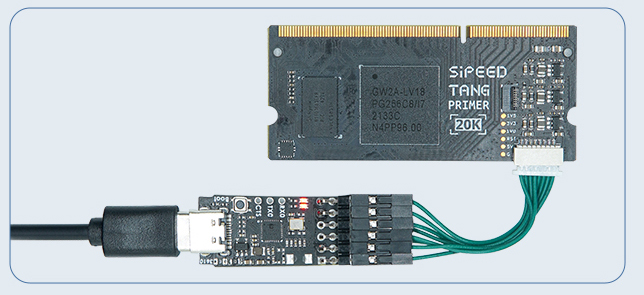

这里汇总一些常见问题，持续更新

## Programmer 相关

**首先确定设备管理器里面有两个 converter，在进行下面的操作**

与上图中一样的话说明电脑与板子连接没问题；不存在的话请稍微等待数秒，可能电脑正在加载驱动，还不行的话尝试使用电脑别的 usb口 或者重新安装驱动。

<h3> 下载频率</h3>

要注意下载频率应该为 `2.5M`或者更低的数值。

不然很可能导致一些奇怪的错误

  
点开查看操作步骤图片

  
  
点击下图中的 Frequency

  
  
接着再点击 Save 即可

### Error found

没有扫描到下载器或者驱动错误，参考上面的 converter 相关说明自己尝试解决。

<!-- 对于 Programmer (下载程序) 要求使用 [这里](https://dl.sipeed.com/shareURL/TANG/programmer) 的文件。
下载后解压替换掉Gowin对应安装目录的Programmer文件夹即可。
不会替换的话可以在下载解压后的Programmer程序中手动添加对应下载文件来进行烧录。 -->

### Cabel open failed

这里的意思是没有找到下载器，可以尝试使用高云半导体所提供的最新的教育版的编程器 [点我跳转](http://www.gowinsemi.com.cn/faq.aspx) 来尝试解决老版本 Programmer 软件的 bug。

<!-- 参考上一步 No Gowin devices found 的操作后，再 programmer 里面进行下面操作：

点击顶部菜单栏的 Edit->Cable Setting->Cable->Query，然后 Save 即可

  
点开查看操作步骤图片

  
  
点击下图中的 Query

  
  
接着再点击 Save 即可

 -->

### No Gowin devices found

这里指的是没有扫描到高云设备，可以尝试使用高云半导体所提供的最新的教育版的编程器 [点我跳转](http://www.gowinsemi.com.cn/faq.aspx) 来尝试解决老版本 Programmer 软件的 bug。

对于 20K 核心板来说可能是接线错了，自己检查一下线序或者检查一下核心板的 8pin 接口有没有被怼歪。

20K 核心板 JTAG 引脚定义可以在背部看到。

<table>
    <tr>
        <td>核心板</td>
        <td>5V0</td>
        <td>TMS</td>
        <td>TDO</td>
        <td>TCK</td>
        <td>TDI</td>
        <td>RX</td>
        <td>TX</td>
        <td>GND</td>
    </tr>
    <tr>
        <td>调试器</td>
        <td>5V0</td>
        <td>TMS</td>
        <td>TDO</td>
        <td>TCK</td>
        <td>TDI</td>
        <td>TX</td>
        <td>RX</td>
        <td>GND</td>
    </tr>
</table>

### ID code mismatch

这种情况是工程芯片与下载芯片不一致。

重新检查工程中的芯片型号（比如工程设置、引脚约束、各个IP中的型号）。

对于 Nano 9K 和 Primer 20K 型号选择应该分别如下：

  
点开查看正确型号选择

  
Nano 9K 应当选择的型号

  
  
Primer 20K 应当选择的型号

  

对于其他板子选择型号的时候与芯片丝印相对应就行。

### 下载卡住、下载非常慢

不要选中带有 Verify 选项的。

自己注意设置一下下载频率，一般设置为 2.5MHZ 不会有异常

  
点开查看操作步骤图片

  
  
点击下图中的 Frequency

  
  
接着再点击 Save 即可

### 找不到下载文件

一般来说生成的下载文件（拓展后缀为.fs）在工程目录下的 impl/pnr 文件夹里面。

  
点开查看相关图文说明

  
  
 在上图中可以看到这个下载文件的路径为 /fpga_project1/impl/pnr/fpga_project1.fs 

  

  
 其中 fpga_project1 为工程目录，impl 为 IDE 生成的目录，然后所需要的文件位于 pnr 文件夹内

  

  
 然后那个拓展名为 .fs 的文件就是下载到 fpga 的文件

### 烧录结束后没反应

一般这种情况是没有选择正确的烧录文件。可以自己先对应着各个板子点灯文档里所选择的芯片型号来检查一下自己的工程，然后看看自己的代码是否有问题。

## IDE 使用相关

### 使用 GAO

GAO 是高云半导体在线逻辑分析仪（Gowin Analyzer Oscilloscope）。安装高云 IDE 之后就能在对应的安装相对路径下看到相关文档了

使用高云半导体所提供的最新的教育版的编程器 [点我跳转](http://www.gowinsemi.com.cn/faq.aspx) 能够正常使用 GAO。

### 查看IP文档

  
点开查看相关说明

    

### 修改设置过的IP

  
点开查看相关说明

    

