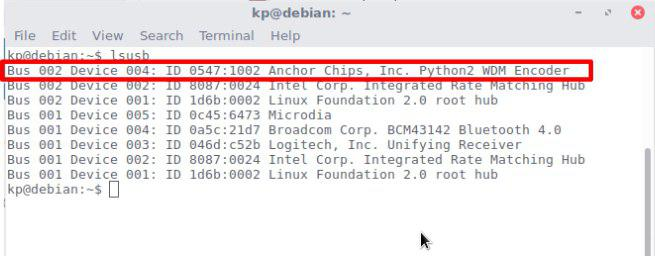

# Linux的开发环境安装

## 安装TD 

想要进行FPGA开发需要安装TD，可以通过[下载站](https://dl.sipeed.com/shareURL/TANG/Premier/IDE)，下载TD安装包和license，如果下载速度过慢的时候，建议使用[百度网盘](https://eyun.baidu.com/s/3i6FbQzr)进行下载

对应应下载的IDE名称为 `TD_5.0.3_28716_NL_Linux.zip`
License文件：`Anlogic_20230606.lic`

双击打开第一个文件进行安装，安装结束之后将 Anlogic_20230606.lic 修改成Anlogic.lic放到对应安装目录的TD5.0.27252/license中

下载完程序后，打开终端并 cd 进入TD压缩包所在的目录。 

```bash
cd <安装程序存档目录的路径 >
```

在linux中 /opt 目录是为所有不属于默认安装的软件和附加包保留的。 在这里我们为 TD创建一个安装目录

```bash
sudo mkdir /opt/TD_DECEMBER2018
```

将 TD 解压到 /opt/TD_DECEMBER2018 目录中：

```bash
sudo tar -xvf  TD_5.0.3_28716_NL_Linux.zip -d /opt/TD_DECEMBER2018/
```   

## 检查默认linux驱动

将 Tang Primer 连接上电脑，执行lsusb命令然后查看信息。确定 USB VID:PID 为 0547:1002，如下图中的显示



## 新建一个udev文件

新建一个udev文件能够让Tang Primer被插件搜索到，
在终端中执行以下命令以创建新的 udev 规则文件。

```bash
sudo nano /etc/udev/rules.d/91-anlogic-jtag.rules
```

将下面的内容复制到上面新建的文件中。

```
SUBSYSTEMS=="usb", ATTRS{idVendor}=="0547", ATTRS{idProduct}=="1002", \
  GROUP="plugdev", \
  MODE="0660"

```

在终端中执行下面的命令来重启udev服务

```bash
sudo service udev restart
```

## 检查设备能否被TD检测到

在td所在路径解压目录指定下面命令来打开gui界面

```bash
./td -gui
```

点击下图中框出来的下载按钮


将开发板与电脑连接，点击下载界面的刷新按钮


> 有奇怪的bug，导致JTAG只能在 400kbps 或者更低的速率运行

