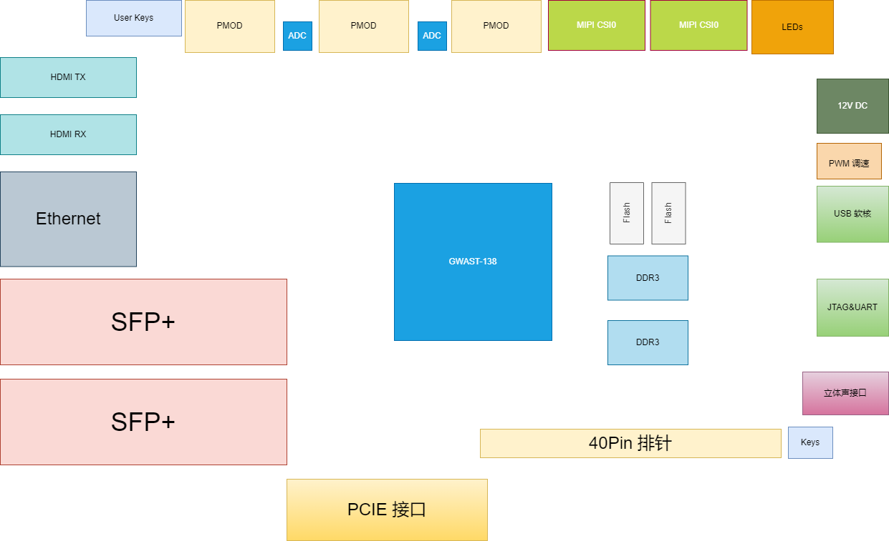

## 产品概述

Tang Mega 138K 使用 22nm 制程 GW5AST-LV138FPG676A FPGA 芯片，具有 138240 个查找表单元和近 300 个 DSP 单元。含有八个速度范围在 270Mbps ~ 12.5Gbps 高速收发器，适合用于光纤或者 PCIE 等高速口传递数据。此外，芯片含有硬核 PCIE，在使用 PCIE 的时候消耗更好的资源，并且得到更佳的性能。适用于高速通信、协议转换、高性能计算等场合。

淘宝购买链接：[点我](https://item.taobao.com/item.htm?id=717932028073)

## 产品外观

## 芯片参数

<table>
    <tbody>
        <tr>
            <td>型号</td>
            <td>GW5AST-138</td>
        </tr>
        <tr>
            <td>逻辑单元(LUT4)</td>
            <td>138,240</td>
        </tr>
        <tr>
            <td>寄存器(REG)</td>
            <td>138,240</td>
        </tr>
        <tr>
            <td>分布式静态随机存储器SSRAM(Kbits)</td>
            <td>1,080</td>
        </tr>
        <tr>
            <td>块状静态随机存储器BSRAM(Kbits)</td>
            <td>6,120</td>
        </tr>
        <tr>
            <td>块状静态随机存储器数目BSRAM(个)</td>
            <td>340</td>
        </tr>
        <tr>
            <td>DSP</td>
            <td>298</td>
        </tr>
        <tr>
            <td>最多锁相环(PLLs)</td>
            <td>12</td>
        </tr>
        <tr>
            <td>全局时钟</td>
            <td>16</td>
        </tr>
        <tr>
            <td>高速时钟</td>
            <td>24</td>
        </tr>
        <tr>
            <td>Transceivers</td>
            <td>8</td>
        </tr>
        <tr>
            <td>Transceivers 速率</td>
            <td>270Mbps-12.5Gbps</td>
        </tr>
        <tr>
            <td>PCIE 硬核</td>
            <td>1, x1, x2, x4, x8 PCIe 2.0</td>
        </tr>
        <tr>
            <td>LVDS (Gbps)</td>
            <td>1.25</td>
        </tr>
        <tr>
            <td>DDR3 (Mbps)</td>
            <td>1,333</td>
        </tr>
        <tr>
            <td>MIPI D-PHY硬核</td>
            <td>2.5Gbps（RX）， 8个数据通道， 2个时钟通道</td>
        </tr>
        <tr>
            <td>硬核处理器</td>
            <td>RiscV AE350_SOC</td>
        </tr>
        <tr>
            <td>ADC</td>
            <td>2</td>
        </tr>
    </tbody>
</table>

## 宣传视频
## 板卡特点

## 硬件参数

## 主控核心

## 外设框图

## 尺寸图

## 引脚图

## 产品对比

## 软件描述

## 硬件资料

[板卡规格书](https://dl.sipeed.com/shareURL/TANG/Nano_20K/1_Datasheet)
[板卡原理图](https://dl.sipeed.com/shareURL/TANG/Nano_20K/2_Schematic)
[PCB BOM](https://dl.sipeed.com/shareURL/TANG/Primer_20K/03_Bit_number_map) (根据自己板子的版本查看里面的 html 文件)
[板卡尺寸图](https://dl.sipeed.com/shareURL/TANG/Nano_20K/4_Dimensional_drawing)
[板卡 3D 模型](https://dl.sipeed.com/shareURL/TANG/Nano_20K/4_Dimensional_drawing)
[部分芯片手册](https://dl.sipeed.com/shareURL/TANG/Nano_20K/6_Chip_manual)

## 注意事项

<table>
    <tr>
        <th>事项</th>
        <th>注意事项</th>
    </tr>
    <tr>
        <td>说明</td>
        <td>请避免静电打到 PCBA 上；接触 PCBA 之前请把手的静电释放掉</td>
    </tr>
    <tr>
        <td>容忍电压</td>
        <td> 使用 GPIO 排针引脚进行外部通信时，要确保 IO 电压是 3.3V，过高的电压会永久损坏 PCBA </td>
    </tr>
    <tr>
        <td>FPC 座子</td>
        <td>在连接 FPC 软排线的时候，请确保排线无偏侈地完整地插入到排线中</td>
    </tr>
    <tr>
        <td>PCIE 金手指</td>
        <td>在测试 PCIE 金手指时候，确保是主机端与板卡都处于关机或者未通电的状态，否则可能会因为插入过程中的易位导致金手指短路。</td>
    </tr>
    <tr>
        <td>插拔</td>
        <td>请完全断电后才进行插拔操作</td>
    </tr>
    <tr>
        <td>避免短路</td>
        <td>请在上电过程中，避免任何液体和金属触碰到 PCBA 上的元件的焊盘，否则会导致路，烧毁 PCBA</td>
    </tr>
</table>

## 联系

Tang Mega 138K 可以在多种场景实现客户不同方面的需要，技术支持和商业合作请联系邮箱 [support@sipeed.com](support@sipeed.com)