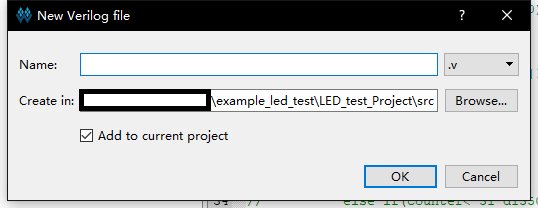

这里我们用点亮板子上的LED来作为例程来快速熟悉一下高云半导体 IDE 的使用流程

## 创建工程

新建工程：File-->NEW-->FPGA Dsign Project-->OK


弹出的选项框设置工程名称和路径（路径和文件名称要求是英文路径）


选择正确的型号：


## 准备代码
    
新建好工程之后接下来进行代码编辑，可以在下图箭头指示的地方新建 “Verilog File”


给文件命名（要求写英文名，不然后续综合很容易报错）


双击文件，可以在右侧的编辑框中进行代码的编写。


以流水灯为例，将下方的 “LED例程代码” 复制并粘贴到自己创建的文件中，也可以自己编写代码，例程代码地址：
<https://github.com/sipeed/TangNano-9K-example>
使用 git clone 后可以在 led/src/LED.v 文件夹内找到代码

```verilog
module led (
    input sys_clk,          // clk input
    input sys_rst_n,        // reset input
    output reg [5:0] led    // 6 LEDS pin
);

reg [23:0] counter;

always @(posedge sys_clk or negedge sys_rst_n) begin
    if (!sys_rst_n)
        counter <= 24'd0;
    else if (counter < 24'd1349_9999)       // 0.5s delay
        counter <= counter + 1'b1;
    else
        counter <= 24'd0;
end

always @(posedge sys_clk or negedge sys_rst_n) begin
    if (!sys_rst_n)
        led <= 6'b111110;
    else if (counter == 24'd1349_9999)       // 0.5s delay
        led[5:0] <= {led[4:0],led[5]};
    else
        led <= led;
end

endmodule

 ```

上面代码完成后需要在 Project->Configuration->Place&Route->Dual-Purpose Pin 中将 `Use DONE as regular IO` 勾选上，不然下面的综合会报错。


## 综合、约束、布局布线

### 综合

保存编辑的代码后转到 “Process” 界面，双击 “Synthesize” 来对我们所编写的代码进行综合。也可以鼠标右键点击看看有啥功能


运行的结果如下图一样 
 

且下方结果栏不出现任何从报错，说明前面编辑的代码无误，如果有错，根据错误提示进行改正即可。

### 约束

- 此处没有涉及时钟约束

想让 Fpga 实现代码的功能，必须将代码中涉及的端口绑定到 Fpga 实际的引脚上。

如下图，在左边的工作区点击 process，然后双击 FloorPlanner （前面的综合如果运行失败，这一步无法进行）


第一次打开会弹出缺少 .cst 文件.选择 “OK” 即可；


可以在这里下载到 Nano 9K 的原理图 [这里](https://dl.sipeed.com/shareURL/TANG/Nano%209K/2_Schematic)
Nano 9K 的 led 部分的原理图如下所示


对于交互式管脚约束有两种方法
- 将对应的端口拖拽到芯片引脚上
- 在 IO 约束中输入端口对应的引脚编号

管教绑定的具体方法可以参考 [SUG935-1.3_Gowin设计物理约束用户指南.pdf](http://cdn.gowinsemi.com.cn/SUG935-1.3_Gowin%E8%AE%BE%E8%AE%A1%E7%89%A9%E7%90%86%E7%BA%A6%E6%9D%9F%E7%94%A8%E6%88%B7%E6%8C%87%E5%8D%97.pdf)。

当然别忘了对着原理图把晶振引脚和全局复位按键引脚也绑定一下

下图是本例程管脚约束示例


### 布局布线

> 未开启管脚复用会提示 error2017， 前文提到过启用方法 [准备代码](#准备代码)

到 Process 下运行布局布线，即双击 `Place&Route` ，结果将如下所示：


## 下载到设备

### 开始下载

双击 Program Device 打开下载软件


接下来是连接芯片型号，烧录固件，可参照下图选择芯片(注意这里是9C)：


以烧录进SRAM为例进行说明，如下图：
设置下载方式：

进行下载：


### 结果展示

结果显示：


## 其他

有固化需求的话设置下载到 flash 即可


有问题可以前往[相关问题](./../../Tang-Nano-Doc/questions.md)

当然也欢迎在下面留言

<p id="back">
    <a href="#" onClick="javascript :history.back(-1);">返回上一页(Back)</a>
</p>

