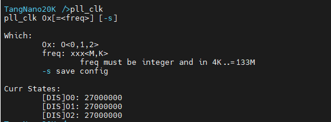
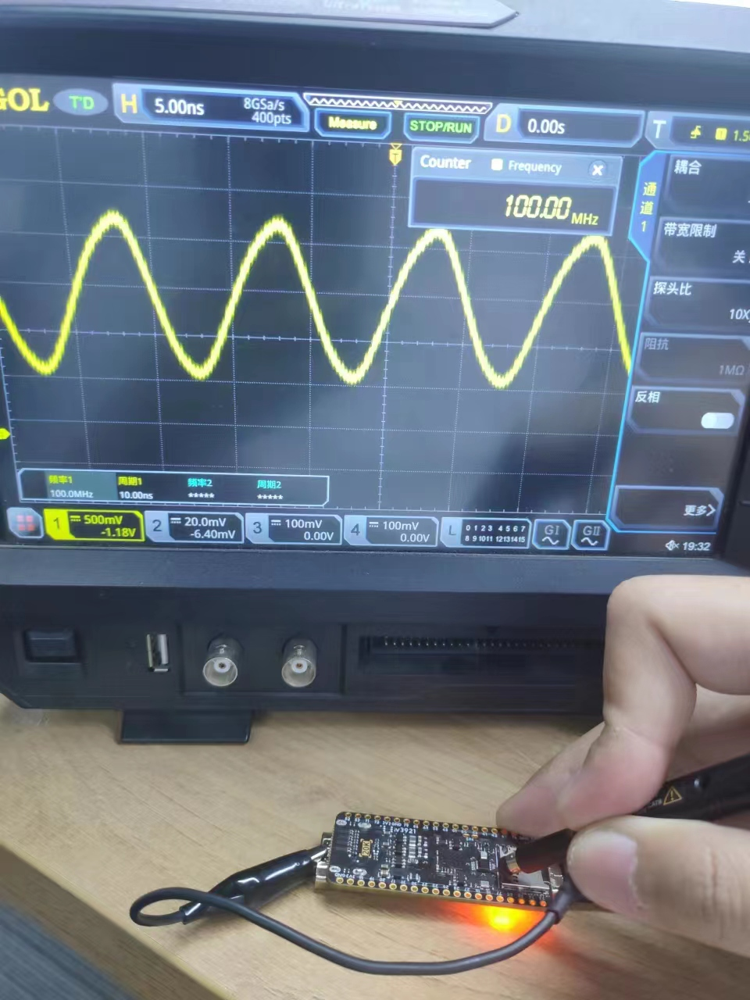
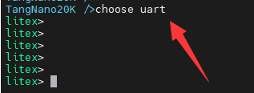
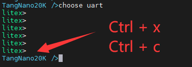

# Tang Nano 20K 开箱

Tang Nano 20K 主要有游戏套餐和普通开发板两种购买选项。

## 初次通电

Tang Nano 20K 默认的固件内容是 [litex](https://github.com/litex-hub) ，并且可以在 [github](https://github.com/sipeed/TangNano-20K-example/tree/main/litex) 直接下载固件。

上电后可以看到板卡上的六颗 LED 以流水灯样式运行着。

通电后 win10 和 win11 会自动加载驱动，然后在电脑的设备管理器中可以看到至少有一个串口设备，这时可以使用 [Mobaxterm](https://mobaxterm.mobatek.net/) 这类支持串口的软件来打开开发板上的串口。

设置波特率为 115200，然后打开开发板上的串口，就能进入默认 litex 固件的终端了。

使用 `Tab` 自动补全命令操作可以看到有一些指令能够让我们直接使用。

以最简单的 leds 为例，输入 `leds` 命令，在后面加上一个数字，接着回车，就可以看到板子上 LED 的变化。

下面是在串口终端中输入了 `leds 62` 后板子上 led 的变化。

可以看到板子上只有一颗 LED 亮起。

如果输入的数字过大的话，它会在串口提示将 led 状态设置成了 `0xffffffff`。

## 隐藏功能

上面的 litex 相关的终端操作都是在 FPGA 上运行的，Tang Nano 20K 除了 GW2AR-18C FPGA 外，还有一个板载的 BL616 芯片，可以进入它的终端来进行其他操作。

和前面一样，在 Mobaxterm 中打开串口之后，可以使用组合键 `Ctrl + x` 然后 `Ctrl + c`，最后按下回车来进入 BL616 芯片终端。

然后按下回车就到了终端了。支持 tab 补全命令。

这里主要需要关注 `pll_clk` 和 `choose` 这两个命令。

### pll_clk

Tang Nano 20K 板子上带有一颗 MS5351 精准时钟发生器，它由 BL616 终端的 `pll_clk` 命令来控制。

MS5351 由支持三路时钟输出，在原理图中可以看到以下对应关系：

上图表示 CLK0 时钟连接到了 FPGA 的 PIN10 引脚，CLK1 时钟连接到了 FPGA 的 PIN11 引脚，CLK2 时钟连接到了 FPGA 的 PIN13 引脚.

- 配置 CLK1 输出 50M 时钟

`pll_clk O1=50M`

<table>
    <tr>
        <td></td>
        <td>
            ① 输入命令后可以看到下面有一些 log  
            ② 再次输入 `pll_clk` 查看当前的配置状态  
            ③ 可以看到 O1 目前是 50M 配置  
            ④ 此处的 [EN] 表示 O1 正常工作，[DIS] 表示被禁用
        </td>
    </tr>
</table>

- 禁用 CLK1

`pll_clk O1`

<table>
    <tr>
        <td></td>
        <td>
            ① 查看当前配置状态  
            ② CLK1 正常工作状态  
            ③ 执行禁用 CLK1 指令  
            ④ CLK1 被禁用
        </td>
    </tr>
</table>

- 保存配置

`pll_clk -s`

- 设置 CLK2 输出 100M 时钟并且保存

`pll_clk O2=100M -s`

### choose

`choose` 命令在 BL616 芯片中的作用是选择 BL616 与 FPGA 的通信方式。

打开串口时默认使用的是 `uart` 模式。在使用命令 `Ctrl + x`和 `Ctrl + c`，再敲下回车后， BL616 退出串口模式，回到终端模式。

- `uart` 模式测试

在 BL616 终端执行 `choose uart` 命令，BL616 与 FPGA 进行串口通信。

输入完命令后终端会看起来卡住了一样，实际上这是因为 FPGA 没有向 BL616 发送串口消息。

默认的固件没有被清除的话，继续敲击回车就会重新回到 litex 终端了。

与前面的叙述一样，使用命令 `Ctrl + x`和 `Ctrl + c`，再敲下回车后， BL616 退出串口模式，回到终端模式。

- `spi` 模式测试

SPI 模式时，BL616 作为 FPGA 的 SPI 从机，接收 FPGA 发送过来的数据。

## 游戏机套装

Tang Nano 20K 可以加载/运行开源 FPGA NES 模拟器 [NESTang](https://github.com/nand2mario/nestang)，下面简述使用步骤。源码可以查看 [Tang Nano 20K nestang github example](https://github.com/sipeed/TangNano-20K-example/tree/main/nestang) 或者 [NESTang](https://github.com/nand2mario/nestang)。

