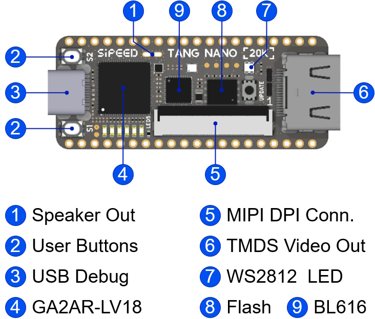
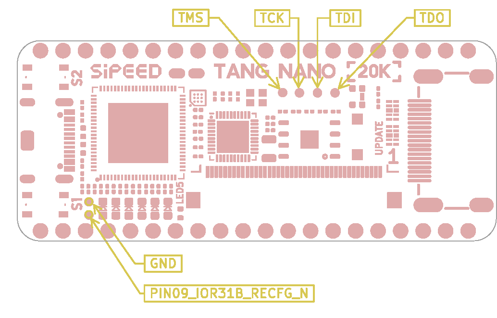

## 简介

Tang Nano 20K 是采用高云半导体 [GW2AR-18 QN88](http://www.gowinsemi.com.cn/prod_view.aspx?TypeId=10&FId=t3:10:3&Id=167#GW2AR) 的一款核心板，芯片内部具有 20736 个逻辑查找表(LUT4) 和 15552 个寄存器(FF)，内部有四个 PLL，还带有多个 DSP 单元支持 18位 x 18位 的乘法运算来加速数字运算。板载 [BL616](https://bouffalolab.com/product/?type=detail&id=21) 芯片来作为 FPGA JTAG 下载器和与 FPGA 通信的串口。板上默认使用 27MHz 晶振用于倍频出 HDMI 显示所需要的时钟，还额外搭载 MS5351 时钟发生芯片来随意生成多种所需要的时钟。

## 外观渲染图

## 详细参数

<table>
    <thead>
    	<tr>
    		<th style="text-align:center">项目</th>
    		<th style="text-align:center">参数</th>
    		<th style="text-align:center">补充</th>
    	</tr>
    </thead>
    <tbody>
    	<tr>
    		<td style="text-align:left">FPGA 芯片</td>
    		<td style="text-align:left"><a href="http://www.gowinsemi.com.cn/prod_view.aspx?TypeId=10&amp;FId=t3:10:3&amp;Id=167#GW2AR">GW2A-LV18QN88C8I7</a>
    		</td>
    		<td style="text-align:left">
    			<table>
    				<tbody>
					<tr>
    					<td>逻辑单元(LUT4)</td>
    					<td>20736</td>
    				</tr>
    				<tr>
    					<td>寄存器(FF)</td>
    					<td>15552</td>
    				</tr>
    				<tr>
    					<td>分布式静态随机存储器S-SRAM(bits)</td>
    					<td>41472</td>
    				</tr>
    				<tr>
    					<td>块状静态随机存储器B-SRAM(bits)</td>
    					<td>828K</td>
    				</tr>
    				<tr>
    					<td>块状静态随机存储器数目B-SRAM(个)</td>
    					<td>46</td>
    				</tr>
    				<tr>
    					<td>32bits SDR SDRAM</td>
    					<td>64M bits</td>
    				</tr>
    				<tr>
    					<td>乘法器(18x18 Multiplier)</td>
    					<td>48</td>
    				</tr>
    				<tr>
    					<td>锁相环(PLLs)</td>
    					<td>4</td>
    				</tr>
    				<tr>
    					<td>I/O Bank 总数</td>
    					<td>8</td>
    				</tr>
    			</tbody></table>
    		</td>
    	</tr>
    	<tr>
    		<td style="text-align:left">板载下载器</td>
    		<td style="text-align:left">BL616</td>
    		<td style="text-align:left">· 给 FPGA 提供 JTAG 下载功能 · 提供 USB 转串口与 FPGA 通信 · 提供虚拟串口用于 FPGA 通过 SPI 通信 · 提供虚拟串口控制 MS5351 输出时钟</td>
    	</tr>
    	<tr>
    		<td style="text-align:left">时钟芯片</td>
    		<td style="text-align:left">MS5351</td>
    		<td style="text-align:left">给 FPGA 芯片提供额外的两路时钟 · 一路差分时钟 · 一路单端时钟</td>
    	</tr>
    	<tr>
    		<td style="text-align:left">显示接口</td>
    		<td style="text-align:left">· 40Pins RGB lcd 连接器 · HDMI 接口</td>
    		<td style="text-align:left"></td>
    	</tr>
    	<tr>
    		<td style="text-align:left"> 单色 LED </td>
    		<td style="text-align:left"> 6 个 </td>
    		<td style="text-align:left"> 共阳极连接 </td>
    	</tr>
    	<tr>
    		<td style="text-align:left"> RGB LED </td>
    		<td style="text-align:left"> 1 个 </td>
    		<td style="text-align:left"> 型号是 WS2812 </td>
    	</tr>
    	<tr>
    		<td style="text-align:left"> 用户按键 </td>
    		<td style="text-align:left"> 2 个 </td>
    		<td style="text-align:left"> 用于自定义逻辑功能 </td>
    	</tr>
    	<tr>
    		<td style="text-align:left"> TF 卡槽 </td>
    		<td style="text-align:left"> 1 个 </td>
    		<td style="text-align:left"> 推拉式 </td>
    	</tr>
    	<tr>
    		<td style="text-align:left"> 功率放大器 </td>
    		<td style="text-align:left"> 1 个 </td>
    		<td style="text-align:left"> 型号是 MAX98357A，用于播放音频 </td>
    	</tr>
    	<tr>
    		<td style="text-align:left"> 存储 </td>
    		<td style="text-align:left"> 64Mbits Flash </td>
    		<td style="text-align:left"> 下载方式参考底部相关问题 </td>
    	</tr>
    	<tr>
    		<td style="text-align:left"> 尺寸 </td>
    		<td style="text-align:left"> 22.55mm x 54.04mm </td>
    		<td style="text-align:left"> 精确尺寸可以参考 3D 文件 </td>
    	</tr>
    </tbody>
</table>

## 外设框图

下面是更详细的外设框图

## 引脚框图

## FPGA Jtag 触点指示图

我们在 Tang Nano 20K 上引出了 Jtag 触点，方便想要使用额外下载器的用户。

## 硬件资料

[板卡规格书](https://dl.sipeed.com/shareURL/TANG/Nano_20K/1_Datasheet)
[板卡原理图](https://dl.sipeed.com/shareURL/TANG/Nano_20K/2_Schematic)
[板卡点位图](https://dl.sipeed.com/shareURL/TANG/Nano_20K/3_Bit_number_map)
[板卡尺寸图](https://dl.sipeed.com/shareURL/TANG/Nano_20K/4_Dimensional_drawing)
[板卡 3D 模型](https://dl.sipeed.com/shareURL/TANG/Nano_20K/4_Dimensional_drawing)
[部分芯片手册](https://dl.sipeed.com/shareURL/TANG/Nano_20K/6_Chip_manual)

## 上手使用

安装 IDE -> 编写代码 -> 烧录进板子

- 安装 IDE [点我]()
- 点灯上手指南 [点我]()

更多例程 [点我]()

### 其他学习资源

- 在线免费教程：[Verilog 教程](https://www.runoob.com/w3cnote/verilog-tutorial.html)（学习Verilog）
- 在线免费 FPGA 教程：[Verilog](https://www.asic-world.com/verilog/index.html) （英文网站）
- Verilog 刷题网站：[HDLBits](https://hdlbits.01xz.net/wiki/Main_Page)（英文网站）
- 在线高云半导体可参考视频教程：[点击这里](http://www.gowinsemi.com.cn/video_complex.aspx?FId=n15:15:26)

## 交流方式

- **交流论坛: [bbs.sipeed.com](https://bbs.sipeed.com)**
- **QQ 交流群：[834585530](https://jq.qq.com/?_wv=1027&k=wBb8XUan)**
- 直接本页下方留言
- 商业邮箱 : [support@sipeed.com](support@sipeed.com)

## 常见问题

### 怎么让固件上电启动

Tang Nano 20K 使用外部 Flash 来存放固件，所以想要让固件存在板子上我们需要烧录到外部 Flash.

### 更多问题前往 [Tang 常见问题](https://wiki.sipeed.com/hardware/zh/tang/Tang-Nano-Doc/questions.html) 查看