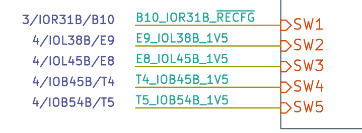
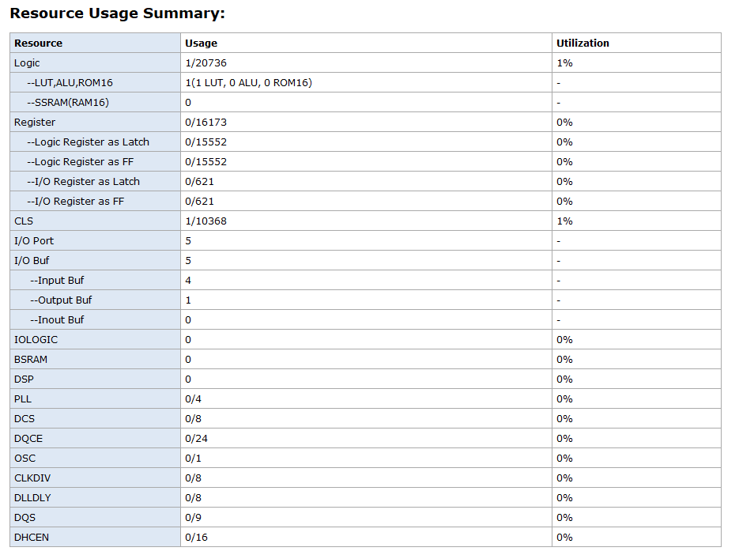

## 原理

### 异或逻辑介绍

异或（xor）是一个数学运算符。它应用于逻辑运算。异或的数学符号为“⊕”，计算机符号为“xor”。
其运算法则为：$$C = A\oplus B = (\overline{A}\cdot B) | (A\cdot \overline{B}) $$

真值表为:

<table>
<tr>
  <td>变量 A</td>
  <td>0</td>
  <td>0</td>
  <td>1</td>
  <td>1</td>
</tr>
<tr>
  <td>变量 B</td>
  <td>0</td>
  <td>1</td>
  <td>0</td>
  <td>1</td>
</tr>
<tr>
  <td>结果 B</td>
  <td>0</td>
  <td>1</td>
  <td>1</td>
  <td>0</td>
</tr>
</table>


在 verilog 中，可以使用 `^` 来表示异或运算，所以可以写成$$C = A\oplus B = A\wedge B $$

同理容易算出，四个信号的异或运算结果如下：

$$E = A\oplus B\oplus C\oplus D = A\wedge B \wedge C\wedge D= (((A\wedge B )\wedge C)\wedge D)$$

根据两项输入的运算方式来计算四项输入运算方法，不难得出以下真值表结果：

<table><tr>
        <td>变量 A</td>
        <td>0</td> <td>0</td> <td>0</td> <td>0</td> <td>0</td> <td>0</td> <td>0</td>
        <td>0</td> <td>1</td> <td>1</td> <td>1</td> <td>1</td> <td>1</td> <td>1</td>
        <td>1</td> <td>1</td>
    </tr>
    <tr>
        <td>变量 B</td>
        <td>0</td> <td>0</td> <td>0</td> <td>0</td> <td>1</td> <td>1</td> <td>1</td>
        <td>1</td> <td>0</td> <td>0</td> <td>0</td> <td>0</td> <td>1</td> <td>1</td>
        <td>1</td> <td>1</td>
    </tr>
    <tr>
        <td>变量 C</td>
        <td>0</td> <td>0</td> <td>1</td> <td>1</td> <td>0</td> <td>0</td> <td>1</td>
        <td>1</td> <td>0</td> <td>0</td> <td>1</td> <td>1</td> <td>0</td> <td>0</td>
        <td>1</td> <td>1</td>
    </tr>
    <tr>
        <td>变量 D</td>
        <td>0</td> <td>1</td> <td>0</td> <td>1</td> <td>0</td> <td>1</td> <td>0</td>
        <td>1</td> <td>0</td> <td>1</td> <td>0</td> <td>1</td> <td>0</td> <td>1</td>
        <td>0</td> <td>1</td>
    </tr>
    <tr>
        <td>结果 E</td>
        <td>0</td> <td>1</td> <td>1</td> <td>0</td> <td>1</td> <td>0</td> <td>0</td>
        <td>1</td> <td>1</td> <td>0</td> <td>0</td> <td>1</td> <td>0</td> <td>1</td>
        <td>1</td> <td>0</td>
    </tr>
</table>

### 拨码开关说明

Tang Primer 20K DOCK 底板配备有一个 5P 的拨码开关。其中一号拨码开关被设计成核心板卡使能位；剩下四个拨码开关用于用户自定义编程功能。

| 拨码开关原理图 | 拨码开关与 FPGA 连接引脚图 |
|---|---|
|  |  |

从上图 [原理图](https://dl.sipeed.com/shareURL/TANG/Primer_20K/02_Schematic) 可以知道，拨码开关连通时对应 FPGA 引脚为高电平输入。

将拨码开关四个角均作输入信号，并将其异或运算，得出一位结果。最终拨码开关状态与输出信号如下表：

<table><tr>
    <td>开关 2</td>
    <td> </td> <td> </td> <td> </td> <td> </td> <td> </td> <td> </td> <td> </td>
    <td> </td> <td>1</td> <td>1</td> <td>1</td> <td>1</td> <td>1</td> <td>1</td>
    <td>1</td> <td>1</td>
</tr>
<tr>
    <td>开关 3</td>
    <td> </td> <td> </td> <td> </td> <td> </td> <td>1</td> <td>1</td> <td>1</td>
    <td>1</td> <td> </td> <td> </td> <td> </td> <td> </td> <td>1</td> <td>1</td>
    <td>1</td> <td>1</td>
</tr>
<tr>
    <td>开关 4</td>
    <td> </td> <td> </td> <td>1</td> <td>1</td> <td> </td> <td> </td> <td>1</td>
    <td>1</td> <td> </td> <td> </td> <td>1</td> <td>1</td> <td> </td> <td> </td>
    <td>1</td> <td>1</td>
</tr>
<tr>
    <td>开关 5</td>
    <td> </td> <td>1</td> <td> </td> <td>1</td> <td> </td> <td>1</td> <td> </td>
    <td>1</td> <td> </td> <td>1</td> <td> </td> <td>1</td> <td> </td> <td>1</td>
    <td> </td> <td>1</td>
</tr>
<tr>
    <td>输出结果</td>
     <td><font color="#4F84FF">0</font></td>  <td><font color="#4F84FF">1</font></td>  <td><font color="#4F84FF">1</font></td>  <td><font color="#4F84FF">0</font></td>  <td><font color="#4F84FF">1</font></td>  <td><font color="#4F84FF">0</font></td>  <td><font color="#4F84FF">0</font></td>
     <td><font color="#4F84FF">1</font></td>  <td><font color="#4F84FF">1</font></td>  <td><font color="#4F84FF">0</font></td>  <td><font color="#4F84FF">0</font></td>  <td><font color="#4F84FF">1</font></td>  <td><font color="#4F84FF">0</font></td>  <td><font color="#4F84FF">1</font></td>
     <td><font color="#4F84FF">1</font></td>  <td><font color="#4F84FF">0</font></td>
</tr>
</table>

上表中，开关那一行中的空白表示开关断开，`1` 表示开关拨下。

### 板载 LED 说明

根据 LED 电路，可以知道当 FPGA 引脚为低电平的时候对应连接的 LED 会亮起来。

| 板载自定义 LED 电路原理图                               | 板载自定义 LED 与 FPGA 连接引脚图           |
| ------------------------------------------------------- | ------------------------------------------- |
|  |  |

这里选择 LED0 作为结果引脚来验证代码现象。

## 操作

### 引脚复用

- DONE

### 端口和引脚

| Port | Direction | Location |
| --- | --- | --- |
| dip_switch[2] | input | E9 |
| dip_switch[3] | input | E8 |
| dip_switch[4] | output | T4 |
| dip_switch[5] | output | T5 |
| led[0] | output | C13 |

### 代码

.. tabset::

    ## xor_led_on.v
    Verilog文件；
    定义了两个按键输入端口，和四个输出端口。根据按键输入的状态，译码输出到对应的端口。
    ```verilog
    module xor_led_on(
      input [5:2] dip_switch,
      output led
    );
      assign led = dip_switch[5] ^ dip_switch[4] ^dip_switch[3] ^ dip_switch[2] ;
    endmodule
    ```

    ## xor_led_on.cst
    物理约束文件；
    将 verilog 代码里的端口绑定到 FPGA 引脚上面
    ```txt
    IO_LOC "led" C13;
    IO_LOC "dip_switch[5]" T5;
    IO_LOC "dip_switch[4]" T4;
    IO_LOC "dip_switch[3]" E8;
    IO_LOC "dip_switch[2]" E9;
    IO_PORT "led" PULL_MODE=UP DRIVE=8;
    IO_PORT "dip_switch[5]" PULL_MODE=DOWN;
    IO_PORT "dip_switch[4]" PULL_MODE=DOWN;
    IO_PORT "dip_switch[3]" PULL_MODE=DOWN;
    IO_PORT "dip_switch[2]" PULL_MODE=DOWN;
    ```

## 效果

四个拨码开关 2、3、4、5 位有奇数个开关拨下是；LED0 熄灭，偶数个开关拨下时，LED0 点亮。

## 补充说明

在高云 IDE 中，我们可以看到自己代码综合后所消耗芯片资源数量以及占比。



从这里面可以看到这次编写的代码消耗量 1 个 LUT，5 个 IO。

对于 CLS 的解释可以查看高云半导体官方文档 [UG288](http://cdn.gowinsemi.com.cn/UG288.pdf) 中的第二章。

Tang Primer 20K 的主控芯片 [GW2A-V18PG256C8IC8I7](http://www.gowinsemi.com.cn/prod_view.aspx?TypeId=10&amp;FId=t3:10:3&amp;Id=167#GW2A) 内部基本逻辑单元为 LUT4。LUT 即为查找表（Look-Up-Table)，本质上就是一个 RAM。它将数据事先写入 RAM 后，每个输入信号就相当于目标内容地址，找出地址对应的内容，然后输出。LUT4 指的是 4 个输入信号的查找表。其简单解释图如下：

> 这里用一个4输入与门为例

<table>
<tr>
<td></td>
<td></td>
</tr>
<table>

本地代码中，我们恰好 4 个输入和 1 个输出。所以使用 1 个 lut4 就够了。

## 相关问题

### 烧录代码后拨动拨码开关 LED 状态没有改变

这是因为拨码开关引脚上拉了，自己将物理约束文件 (.cst) 文件里面的 `PULL_MODE=UP` 改成 `PULL_MODE=DOWN`