# 荔枝派Zero

## 缘起

那年仲夏之夜，我吃着荔枝DIY了荔枝派One。
One的众筹和生产过程可谓万分曲折，不过整个流程经历下来也让我更清楚怎样的Pi才是一块好Pi。

> 笔者是业余时间将项目中使用过的主控芯片部分电路抽出，重新设计布局而成荔枝派系列板卡，时间并不充分，但是提供qq群与论坛供大家交流整理资料；

--------

> 希望初次学习linux使用的朋友能够钻研在使用中遇到的问题并与大家交流分享，而不要当伸手党，真正的linux大神不是伸手伸出来的，也不是培训班里培训出来的，**而是自己踩坑踩出来的**。

荔枝派Zero从去年年末开始构思，设计目标就是一块满足创客和嵌入式工程师一切美好设想的Pi：

> **低成本，小体积，高性能，易使用，多扩展。** 

45x26mm，略长于SD卡；24MHz~1.2GHz；多种开发语言，`直插面包板`，同时 `全引脚邮票孔引出` ；支持多种外设模块

**目标应用场景是：**

- 使用较复杂的通信接口和协议的物联网应用
- 需要较美观，复杂逻辑的人机交互界面的应用
- 需要较多运算(相对于常用MCU)的应用场景
- 需要使用linux下的开源软件进行快速开发的场景
- 高端极客玩家，在体积、性能、易用性 上取得平衡。
- 入门级玩家，软件工程师，使用熟悉的语言进行硬件diy。

## 初识

荔枝派Zero基于Allwinner V3s (**ARM Cortex-A7 CPU, 1.2GHz, 512Mbit DDR2 integrated**), 可从板载SPI Nor Flash(SOP8 16MB / WSON8 32MB) 或者 TF卡启动。

Zero采用了巧妙的引脚引出设计：

- 兼容常用的2.54mm插针，甚至可以 **直插面包板** 使用；
- 使用1.27mm邮票孔引出，可以 **直接贴片** 使用；
- 1.27mm邮票孔也可以使用 **2.54插针偏移半针位焊接** ，适合diy
- 板载 **FPC40接口** ，可以转接多种实用外设
- 专为Zero设计的 **TF wifi** 模块，可插卡槽，也可直插2.54焊针。

荔枝派Zero 麻雀虽小五脏俱全，具备了常用的多种低速外设（UART，SPI，I2C，PWM，ADC），单片机上少有的高速接口它也有不少（OTG USB，MIPI CSI，EPHY，RGB LCD），还内置了CODEC（直接耳机麦克）~
Zero的引脚布局示意图如下：

- “2.54mm Pinout”标识是可直接插入面包板或者使用标准杜邦线连接的。

- “1.27mm”标识的是较为不常用或者不方便手工接线的引脚，一般在贴片时使用，或者也可以用2.54插针偏移半个针位使用。

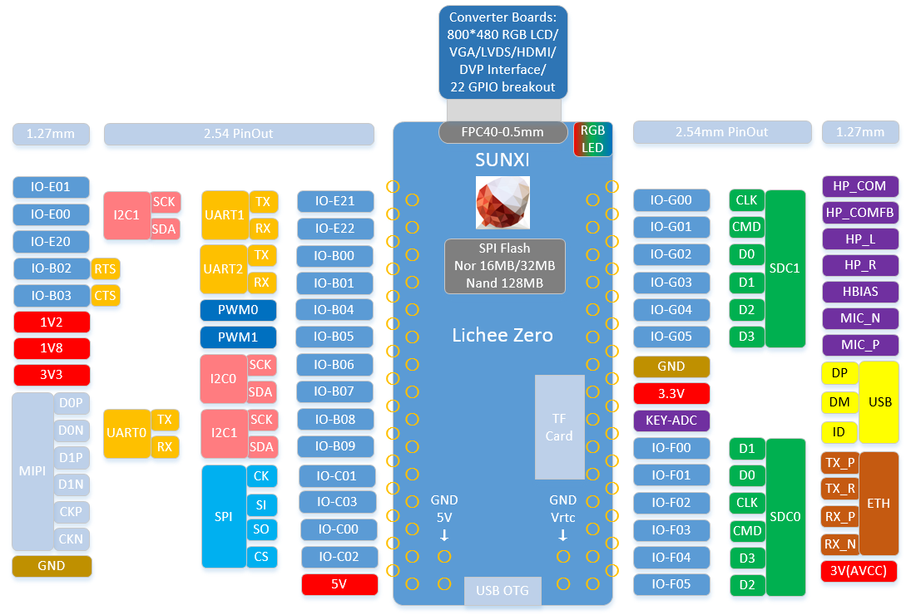

话不多说，下面开始曝照！

> 由于以下样板由我手工焊接，难免有些焊接痕迹，焊得丑请轻喷，成品会用机贴的。

正面：从左往右为：RGB LED；主芯片；tf卡槽；LCD背光电路；micro usb otg。

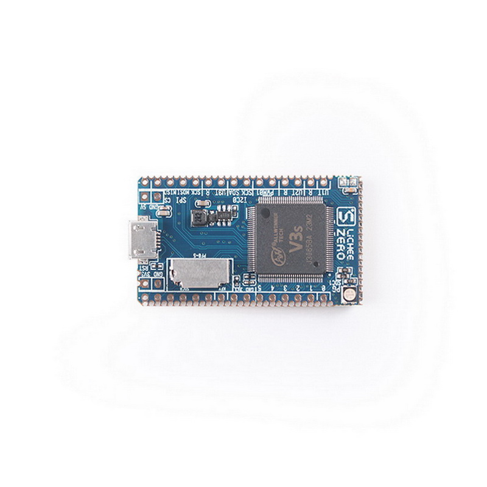

背面：从左往右为：电阻屏控制器；DCDC芯片；预留的SPI flash接口，兼容SOP8和WSON8封装的SPI flash（16/32MB）；FPC40接口。

正反面一起看：

插针引出演示：
直插面包板：双列插针间距900mil，可直插面包板！
应该是首款可直插面包板的Cortex-A7水果派~ 手残党的福音~

Zero的常用引脚使用2.54mm插针引出，如果想用到全部引脚，也不必像其它板子那样飞线，仍然可以用2.54插针和杜邦线搞定！

如下图所示，邮票孔是1.27mm间距，所以刚好可以间隔半个脚位焊上2.54mm插针，轻松使用杜邦线连接！

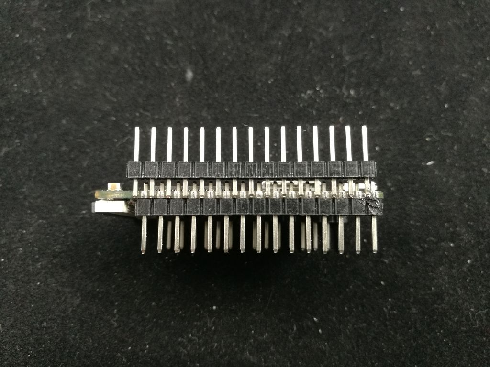

上面的高清大图看上去是不是觉得Zero比较大呢？没有比较就没有伤害，其实Zero只比SD卡长一点！ 与SD卡一起比个子：

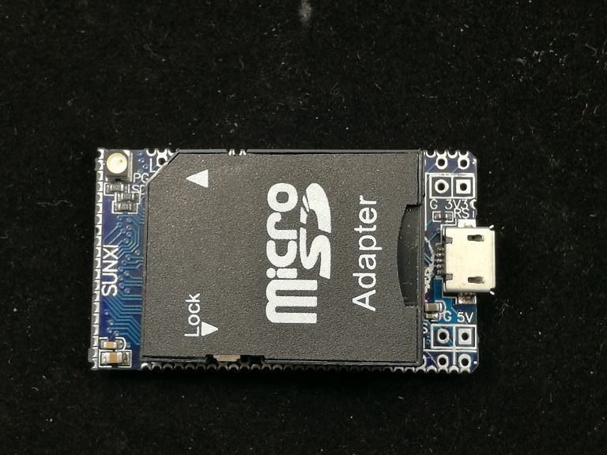

Zero默认运行主频高达1G（最高1.2G），你是否认为它功耗感人？

NONONO，其实它以1G主频跑起linux后的运行电流 和 STM32F4 以168MHz主频全速运行的电流（93mA）差不多！

比STMF7全速运行于216MHz的电流（193mA）要低一半以上！

有图有真相：

再来看看Zero全速运行时的发热情况：

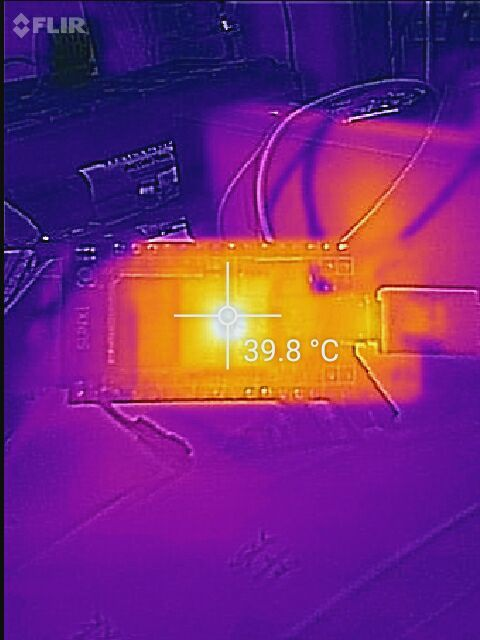

是的，仅有40度左右，略高于体温，比H3之流 动辄80℃+的CPU温度要让人安心多了，再也不用画蛇添足地给水果派加装散热片了~

这还是1GHz主频下的电流和发热情况，Zero可以在24MHz~1.2GHz之间以24MHz步进设置主频，如果你用24MHz或者48MHz当单片机用的话，那耗电还会低上不少！

## 细探

Zero除了核心板本身，还设计了一系列常用的外设以及配套底板用于功能验证，在此为您细细道来。

### TF Wifi卡

IoT大行其道的今天，联网功能也必不可少。

Zero可使用Wifi，Ethernet连入网络，还在配套演示底板上集成了Lora模块，可用作Lora网关。

出于体积考虑，Zero核心板上并未加入wifi功能，但是我专为Zero设计了小巧的tf wifi 模块，可用多种方式与Zero叠加。

下图就是TF WiFi模块：

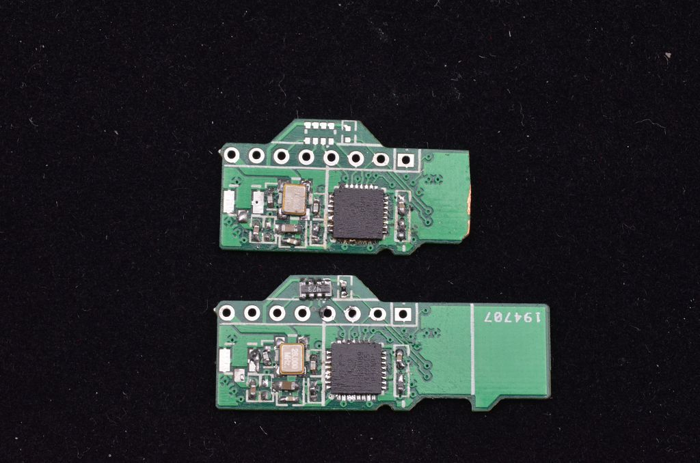

模块本身使用0.8mm厚度 PCB制成，与TF卡厚度（0.75mm）极为接近，可以直接插入TF卡槽！

注意到上图有一长一短模块，长模块是为常用的全槽TF卡槽兼容使用，短模块是为Zero上的半槽TF卡槽使用。

由于PCB仅有0.8mm厚，所以收到PCB后，只要使用剪刀沿白色丝印剪下，即可获得半槽使用的TF WiFi模块！

TF Wifi卡的多种使用方法：

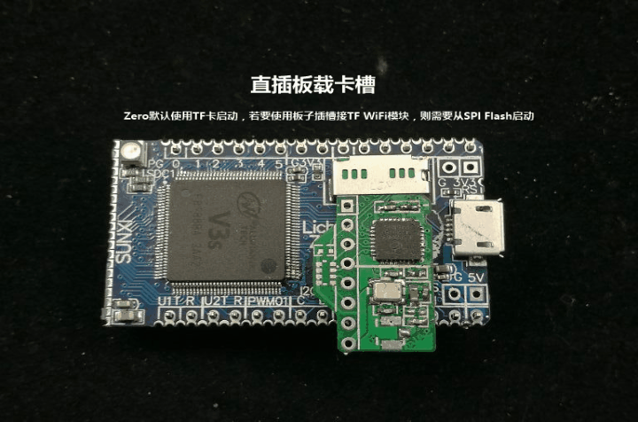

#### 直插板载卡槽

> **注意Zero默认使用TF卡启动，若要使用TF插槽接TF WiFi模块，则需要从SPI Flash启动。**

#### 2.54插针叠加

当使用TF卡作为启动介质而占用了板载TF卡槽时，仍可使用2.54插针轻松叠加使用！

Zero精心排布了2.54插针的引脚顺序，并在TF Wifi 模块上预留了相同顺序的2.54mm间距焊盘，因此可以直接使用2.54mm插针叠加！

> *注意右侧刚好没有和FPC40的翻盖干涉，仍可使用座子外接屏幕等外设~ *

#### 直插底板的TF卡槽

底板上也预留了TF卡槽，因此选购了底板的话可以直插底板上的卡槽。

### 通用40P RGB液晶屏

Zero采用了和One兼容的通用40P RGB液晶屏（含触摸屏），并且板载了电阻屏控制器，支持触控操作。之前买了One的液晶屏套餐的可复用之前的液晶屏。

下图是5寸 480x800高清液晶屏，另有480x272的4.3寸普清液晶屏。

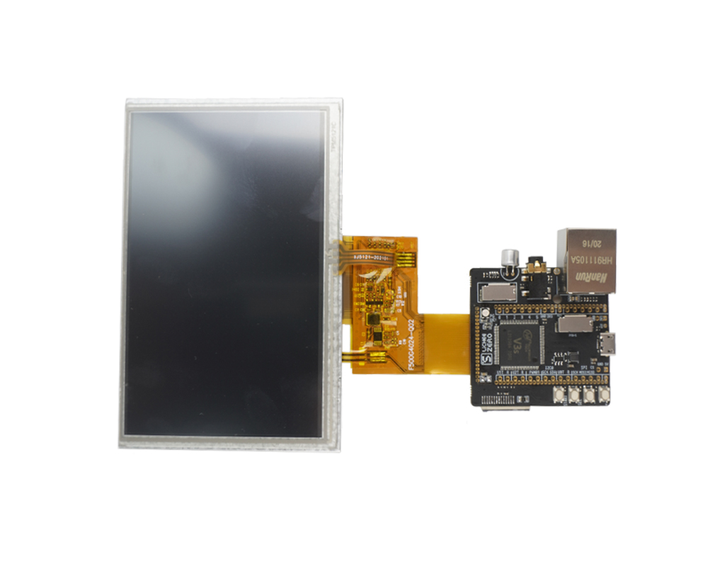

### RGB转VGA模块

去年年中以来，液晶屏价格暴涨，如果无法接受目前液晶屏价格的话，可以选择RGB转VGA模块，可接普通显示器使用。
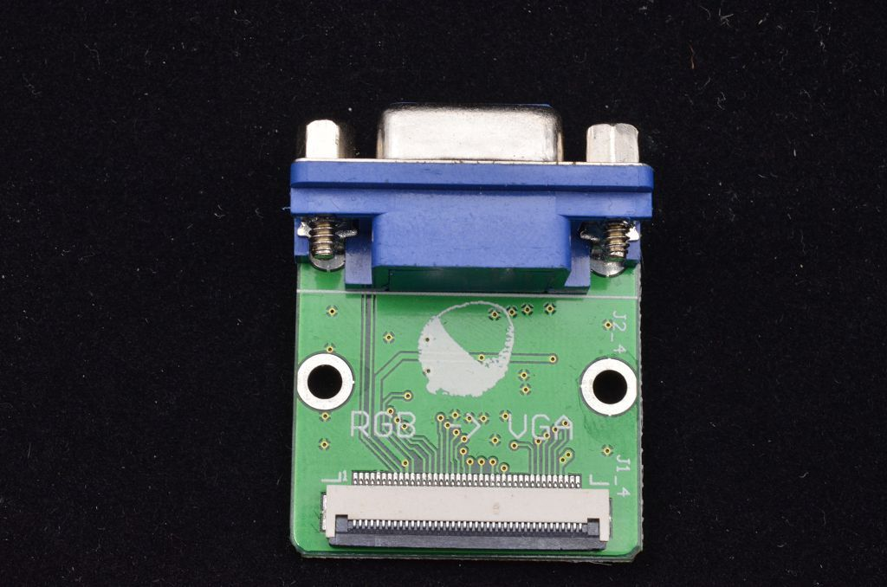

### RGB转HDMI模块

如果你的显示器没有VGA接口（土豪高端显示器），可选用RGB转HDMI模块，该模块可直插HDMI显示器。

> **注意：截止发稿时，笔者还没时间搞这模块的驱动，该驱动列入开发者奖励计划（详见后文）。**

### RGB转LVDS模块

如果你手中有闲置的笔记本显示屏（非高清，1280x800, 1366x768或更低分辨率），则可选购该模块。注意笔记本屏幕一般需要额外的LED背光电源供电。
> *该模块支持单八，单六 LVDS屏；正面FPC座为单八接口，背面为单六接口。*

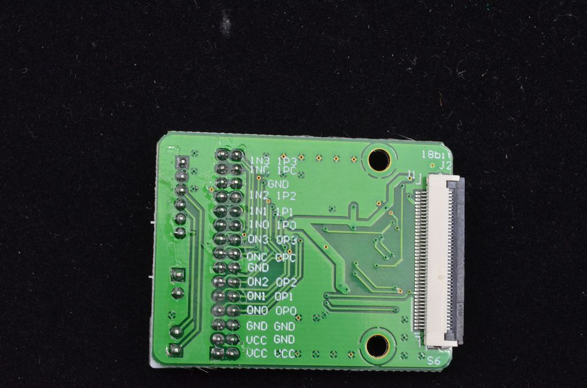

如果你手头没有闲置笔记本液晶屏，又想尝试大屏，众筹套餐中提供了10.1寸LVDS平板屏幕，1280x800分辨率，内置led恒流升压驱动电路。

### RGB转DVP CSI模块

Zero的DVP CSI接口引脚和RGB引脚复用，所以之前购买了One的摄像头的用户，可以使用此转接板转接原DVP接口的24Pin摄像头（OV7670，OV2640等）。
> *注意：截止发稿时，笔者还没时间搞改摄像头驱动，该驱动列入开发者奖励计划（详见后文）。*

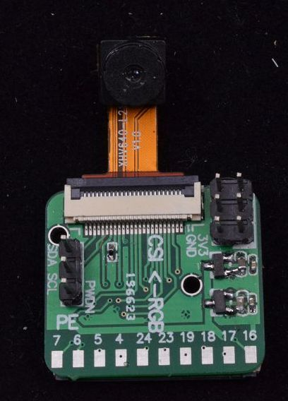

### RGB转GPIO模块

如果你没用到LCD屏，又需要很多IO，则可以使用该RGB转GPIO模块，它将转出22个GPIO，以及两路ADC（使用电阻屏驱动器），和若干电源引脚。

## 添翼

前面介绍的模块主要是FPC40的转接板，对于Zero上1.27邮票孔引出的其它引脚，除了可以用2.54插针偏移半位焊接引出外，也可使用配套底板（Docker）直接贴片上去，更加紧凑，也方便验证、使用各个高速接口。

Docker布局概览：
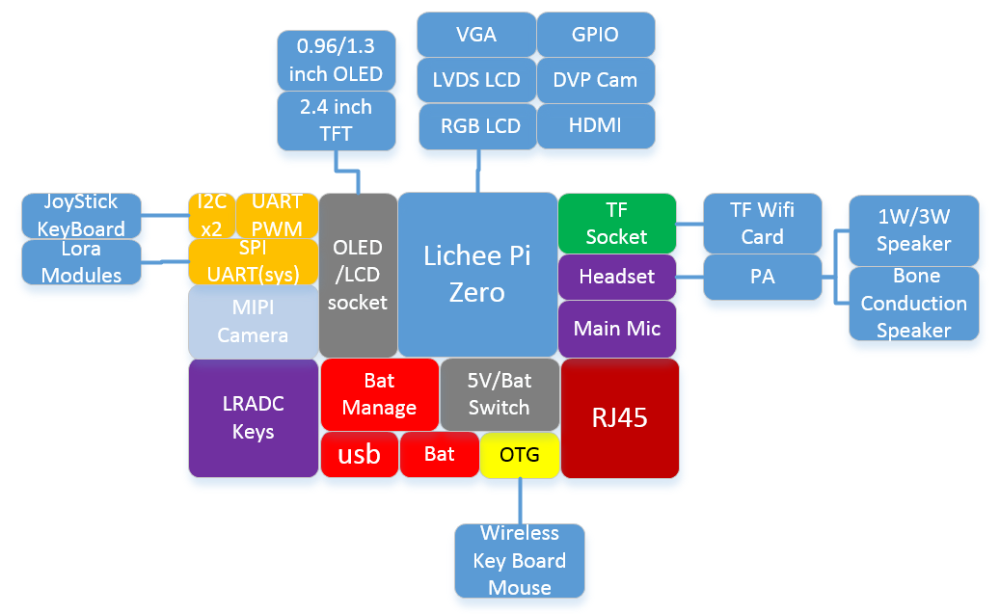

实物图镇楼：

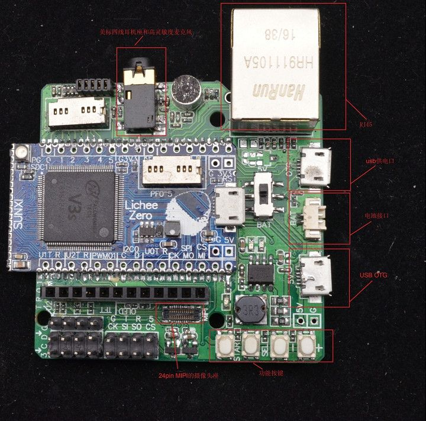

底板左下方有两三排插针，分别是I2C，SPI，UART，PWM的引出插针。

右下方有四个功能按键，是使用Zero的ADC功能实现的。

右侧为usb供电口，电池接口，USB OTG口；底板的电源电路支持单节锂电池的充放电管理，以及5V升压。

右上方为内置网络变压器的RJ45接口。
> *注意到RJ45接口较高，体积较大，所以默认不焊接上去，只附上该座子，有需要验证以太网口的朋友可自行焊接；需要DIY掌上设备的朋友可留空该座来减小底板体积。*

底板上方为美标四线耳机座和高灵敏度麦克风。

底板下方配有一个24pin MIPI的摄像头座，座子为b2b连接器（axe624124）。
配套的是500W像素自动对焦的OV5648摄像头。
> *注意：截止发稿时，笔者还没时间搞这模块的驱动，该驱动列入开发者奖励计划（详见后文）。该摄像头在官方SDK里有驱动，但尚未在主线内核中适配。*

### 底板的功放模块

Zero自带CODEC，但自带的CODEC只能推动耳机，所以底板上贴的是耳机座。

考虑到用Zero做WiFi音箱或者其它自带扬声器发声的设备（如掌机？），底板上预留了功放模块的接口，即TF卡槽后面的5pin 排母。

在该接口上可堆叠PA模块，如下图所示
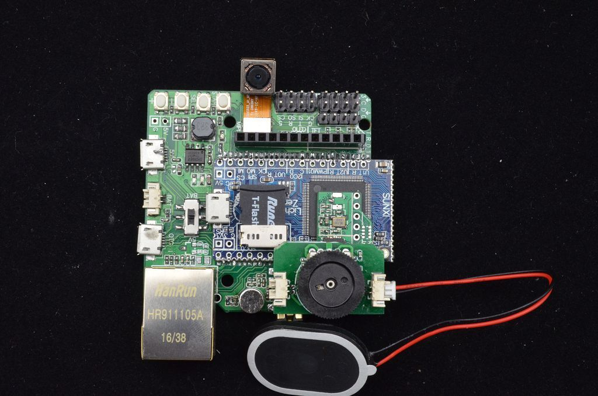

PA模块可带动3W*2个扬声器，并自带音量旋钮，适合做一些手持设备。

以下是可选配的扬声器：

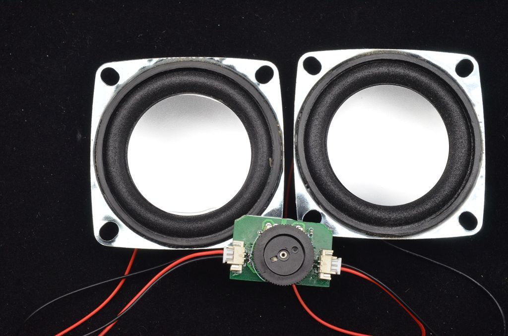

> *也可搭配骨传导扬声器！可做骨传导耳机或者振动音箱~*

### 底板的显示模块

底板下方有一排2.54排座，可用于插接I2C接口的OLED或者SPI接口的TFT。

0.96寸128x64 OLED:
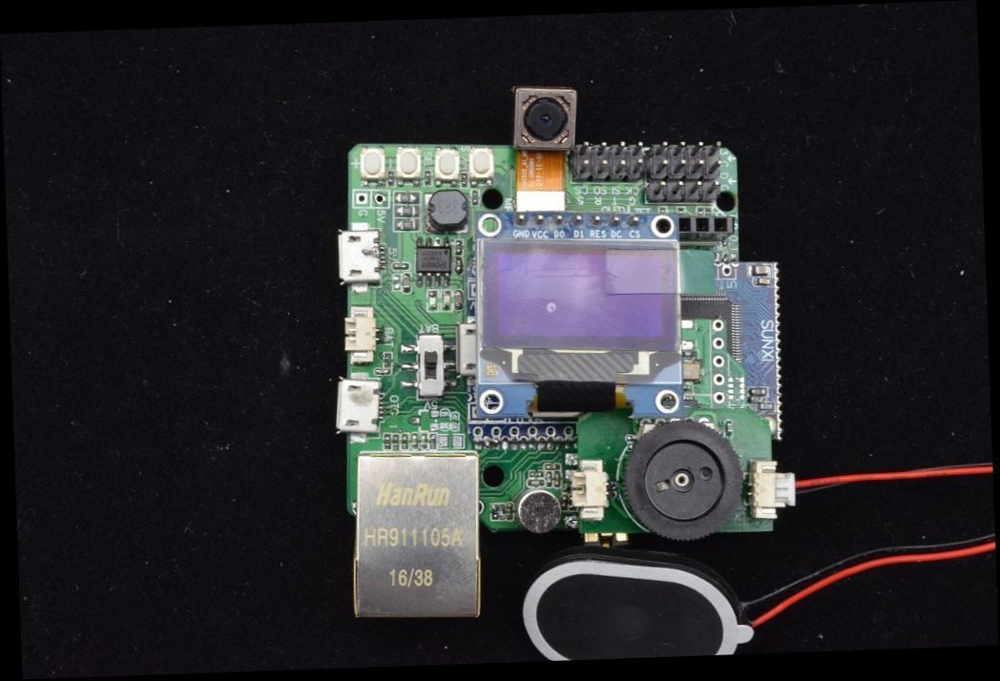

1.3寸128x64 OLED:
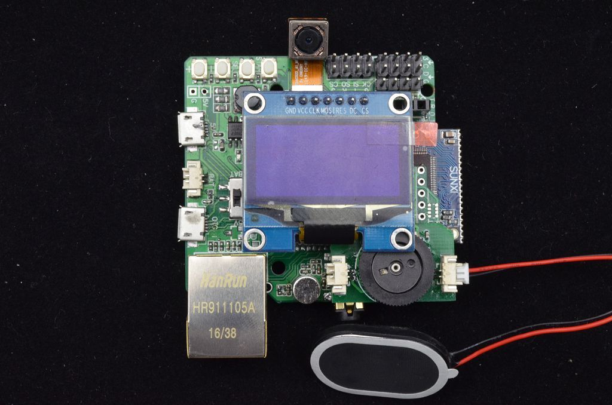

2.4寸 240x320 TFT:

### 底板的输入设备

底板的输入除了四个ADC做的功能按键外，还可选配下小手柄/键盘。

手柄与2.4寸屏幕搭配食用风味更佳 /斜眼笑
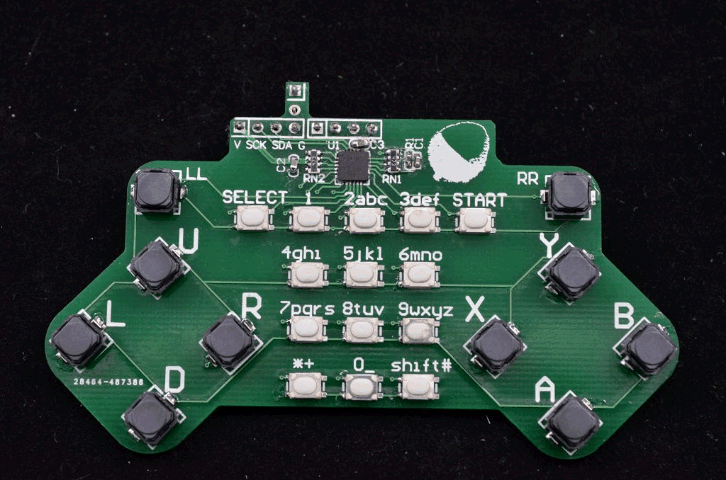

### 底板的通信接口

底板上有三个通信接口，分别是TF Wifi卡接口，RJ45 以太网接口，和Lora模块接口。

----------

前面介绍的TF Wifi卡插底板的示意图：

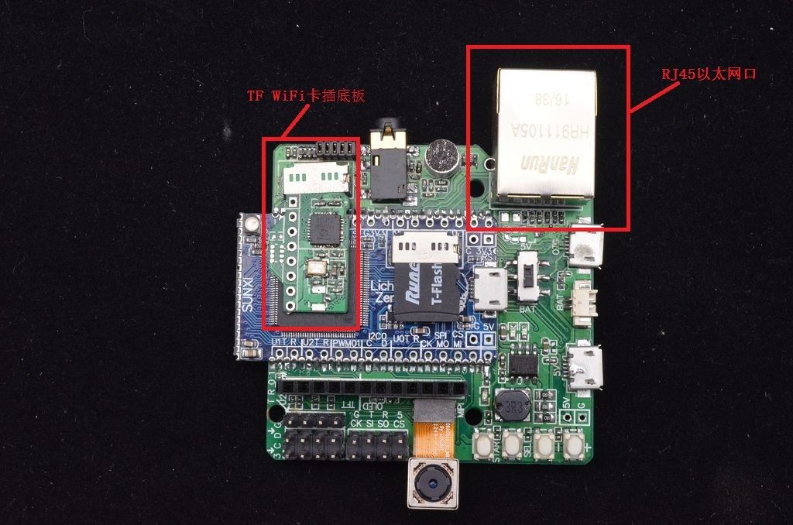

----------

底板背面的Lora模块示意图：

Lora模块本身可以全双工，但是Zero作为网关使用时，底部Lora模块配置为一发一收，可以显著降低丢包率。

Lora网关的相关参数为：

1. 星形拓扑，空旷通信距离15km
2. xxx

### 底板的语音助手外设

底板的耳机口可外接麦克风阵列模块，实现远场语音识别（声源单位，波束成型），阵列模块自带关键词唤醒功能。

麦克风阵列模块默认搭配高灵敏度驻极体麦克风，可选配硅麦克（一致性好）

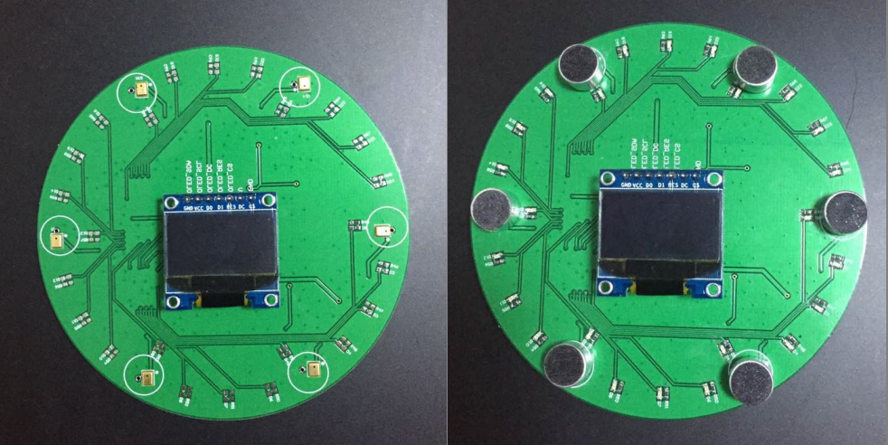

麦克风阵列的主要参数为：

1. 板载6颗驻极体/硅麦克，24颗LED，可选配OLED
2. 声源定位精度优于15°，板上LED或者OLED指示方位
3. 消除混响，500ms以内室内混响
4. 波束成形，可指定6方位波束成形，具有噪声抑制和语音增强功能，室内环境下语音识别距离约5m。
5. 关键词唤醒，可设定自定义关键词唤醒（使用拼音配置，方便快捷，无需上传服务器计算特征码），引脚输出唤醒边沿。
6. 一路模拟音频输出，一路I2S数字音频输出。
7. 可使用I2C/UART配置模块参数，读取信息（声源角度等） 

## 惊艳

Zero核心板或者配套底板还可选配无线键鼠与锂电池，搭配定制的LCD转轴支架，简单组装即成一台迷你笔记本！
> *注：Zero底板具有锂电池充放电管理功能；Zero核心板不可直接给锂电池充电。*

使用Zero核心板制作的简易“笔记本电脑”，只需一块电池，一个屏幕，一个无线键鼠。
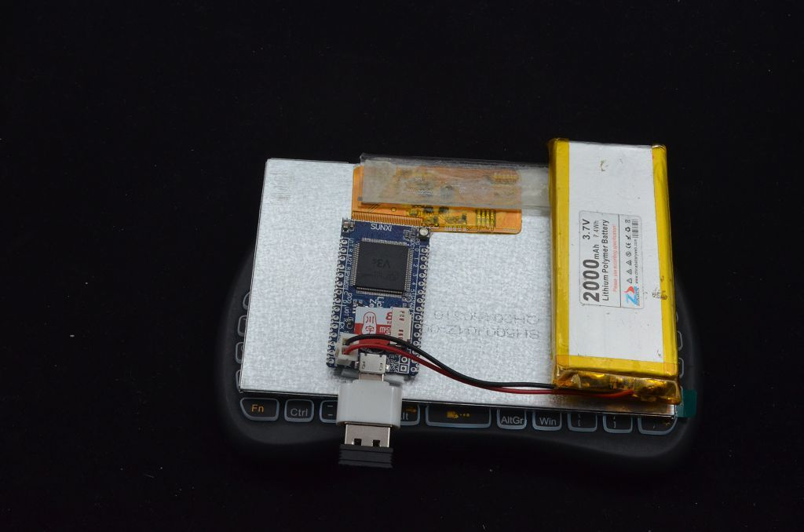

Zero开启debian桌面系统
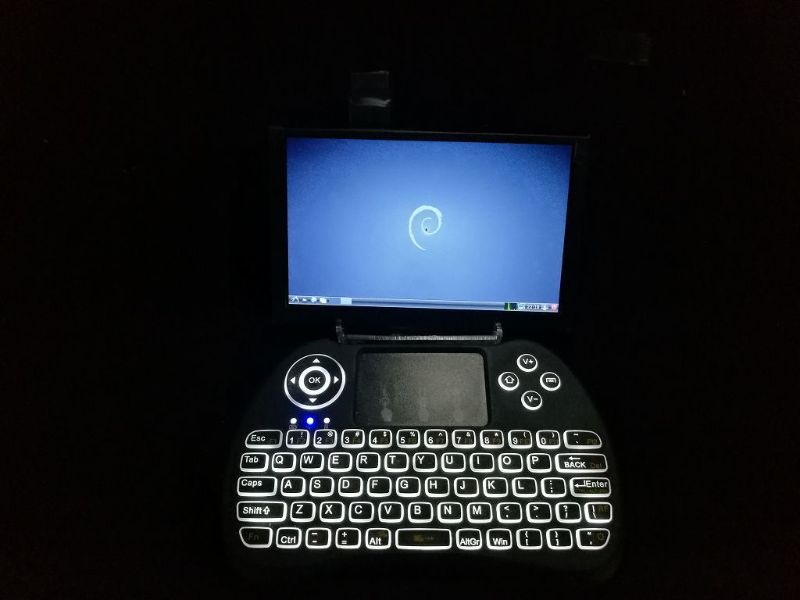
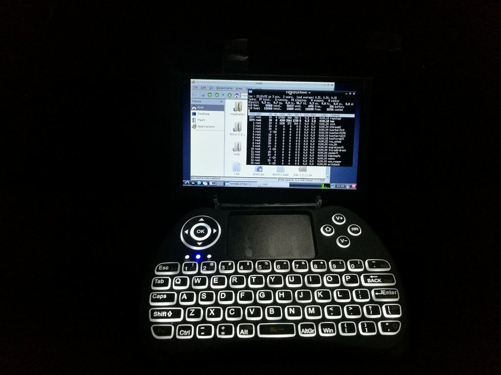

回顾GBA经典游戏
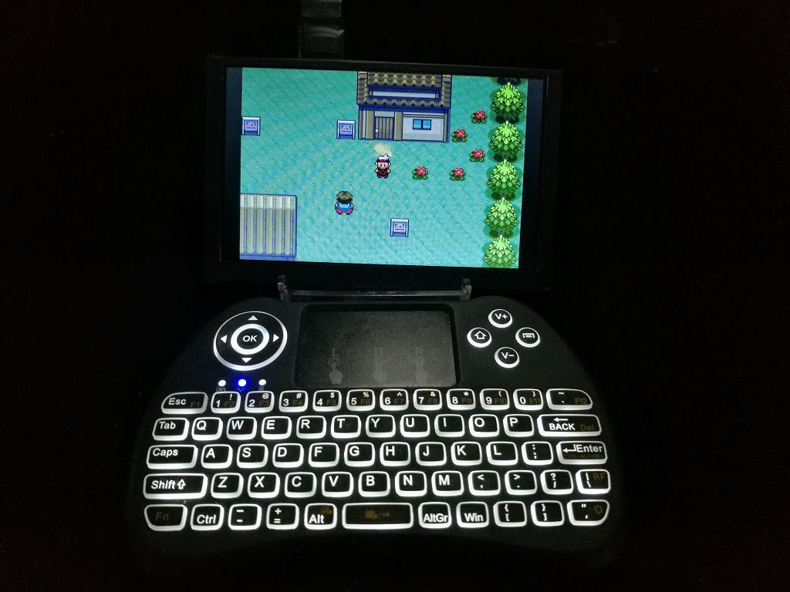

Zero畅玩经典游戏DOOM！
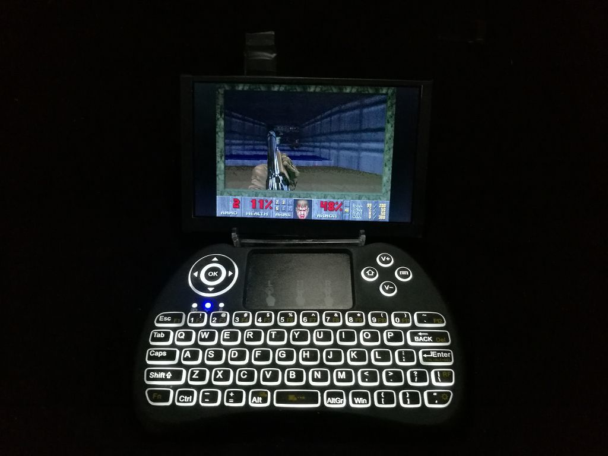

荔枝派Zero还可以运行树莓派系统！原来你是披着树莓皮的的荔枝派！
> 注：Zero由于内存限制，运行树莓派系统会较为卡顿。

开启键盘夜光的靓图！是不是有大牌范呢？

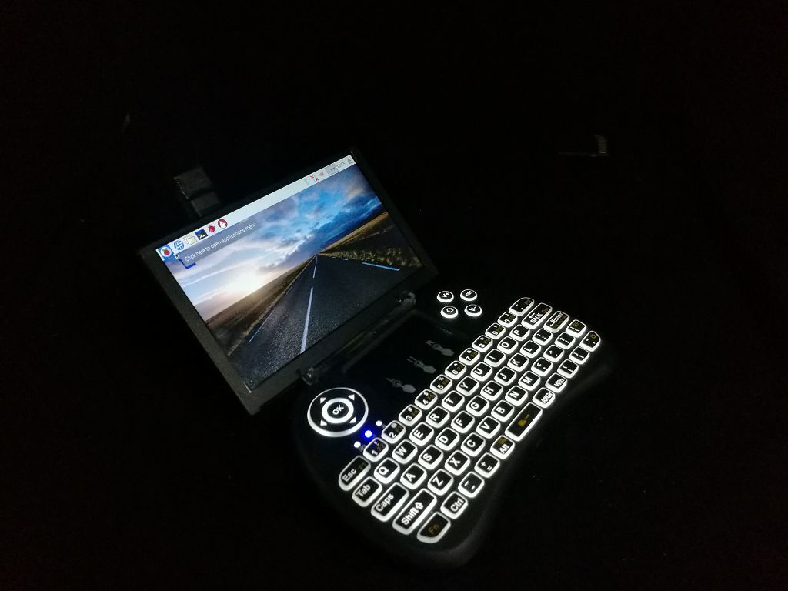

详情还可戳 [视频演示](http://v.youku.com/v_show/id_XMjYwNzkyOTM1Ng==.html?spm=a2hzp.8244740.userfeed.5!2~5~5~5!3~5~A) 欣赏喔~

## 未完待续

配件全家福（貌似还漏了个别配件）
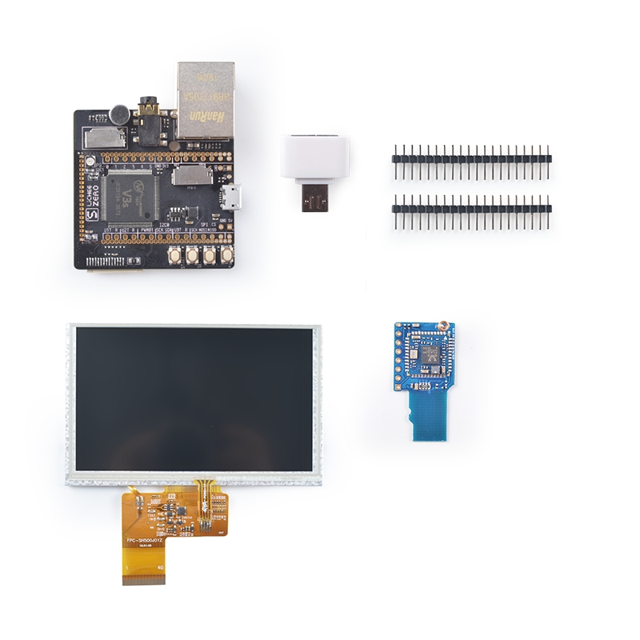
