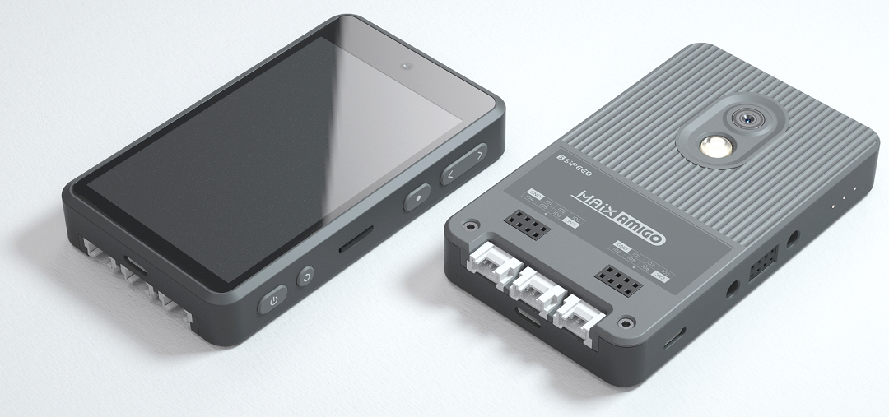
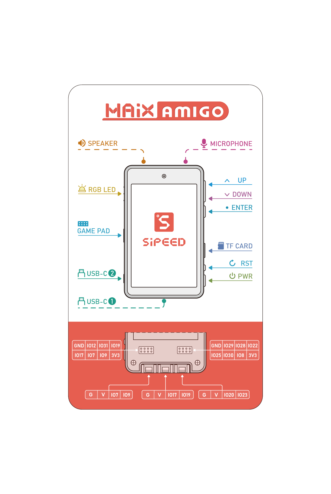
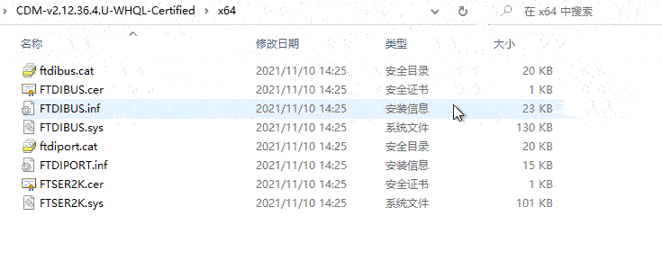

## Overview

  SIPEED **MaixAmigo** can develop a programming learning kit, MaixAmigo integrates 30W pixel camera, expandable TF card slot, user button, 3.5'TFT display, 520mAh lithium battery, speaker, microphone, SPMOD, GROVE on the hardware Expansion interface, etc.

  MaixAmigo is equipped with MaixPy by default on the software. Users can easily use MicroPython syntax to quickly develop various AIoT developments such as face recognition and object classification. At the same time, it also reserves development and debugging interfaces, which can also be used as a powerful AI learning and development board.

## Appearance and function introduction

### Appearance list



### Onboard functions

| Project | Description |
| --- | --- |
| CPU: | Dual-core 64bit RISC-V / 400MHz* (double-precision FPU integration) |
| Memory: | 8MiB 64bit on-chip SRAM |
| Storage: | 16MiB Flash, support micro SDXC expansion storage (max 128GB) |
| Screen: | 3.5-inch TFT display, resolution: 320\*480, support capacitive touch (FT6X36) |
| Camera: | OV7740 (rear camera) and GC0328 (front camera) 30W pixels each (maximum resolution VGA:640\*480) |
| Battery: | Onboard rechargeable lithium polymer battery (capacity 520mAh) |
| Onboard speaker and microphone | Integrated single audio controller ES8374 1W 8Ω speaker |
| Onboard interface: | USB-C \*2 (K210 debug power supply interface + compatible STM32 core board USB interface) |
| Onboard sensors: | MSA301 three-axis acceleration sensor |
| Lights: | Three monochromatic LED lights, one flashlight | 
| TF card slot: | Multimedia resource expansion, support large-capacity storage |
| Battery: | 520mAh Lithium Battery |

### Pin Resources



### Hardware onboard expansion interface

MaixAmigo has opened two highly extended interfaces to users: three [SP-MOD](./../modules/sp_mod/README.md) and three [Grove](./../modules/grove/README.md) .md) interface, users can easily do DIY.

### Onboard I2C device

MaixAmigo onboard I2C sensor/IC

| IC     | Device id | I2C address (7-bit address) | MaixPy read address | Sample code |
| ------ | --------- | --------------------------  | ------------------- | ----------- |
| ES8374（Audio codec） | 0x08      | 0x10                        | D(16)               |[code](https://github.com/sipeed/MaixPy_scripts/blob/79a5485ec983e67bb8861305a52418b29e0dc205/modules/others/es8374/es8374.py)|
| MSA301 (Triple Axis Accelerometer)| 0x13      | 0x26                        | D(38)               |[code](https://github.com/sipeed/MaixPy_scripts/blob/7fea2359a7f0c05f586be915aa8e6112262e0caa/multimedia/gui/maixui/msa301.py)|
| AXP173 (Power management IC)| 0x68      | 0x34                        | D(52)               |[code](https://github.com/sipeed/MaixPy_scripts/blob/7fea2359a7f0c05f586be915aa8e6112262e0caa/multimedia/gui/maixui/pmu_axp173.py)| 


## Get started

MaixAmigo also uses MaixPy to get started with AIoT. Due to the particularity of the hardware, please use MaixPy after [Configure amigo hardware](https://github.com/sipeed/MaixPy_scripts/blob/master/board/config_maix_amigo.py)(If not configured, the photos taken by the camera will be noisy) .

Before development, we need to understand and prepare related tools to reduce the pitfalls we have to follow because of insufficient preparation.

Steps to get started:

1. Download the required drivers and software
2. Connect the development board to the computer and install the USB driver
3. Update the latest firmware
4. Download and open the latest MaixPy IDE
5. Connect MaixPy IDE to the development board Run MaixPy sample program

### Software and hardware preparation

Hardware preparation:

  - **Computer** one
  - **MaixAmigo** Development Board
  - One **reliable** USB Type-C data cable: pay attention to a **reliable** data cable

Software preparation:

  - USB driver: **FT2232** ->[[download link here](https://dl.sipeed.com/MAIX/tools/ftdi_vcp_driver)](https://dl.sipeed.com/MAIX/tools/ftdi_vcp_driver)
  - Kflash_gui: [https://dl.sipeed.com/MAIX/tools/kflash_gui](https://dl.sipeed.com/MAIX/tools/kflash_gui)
  - MaixPy IDE: [https://dl.sipeed.com/MAIX/MaixPy/ide/_/v0.2.5](https://dl.sipeed.com/MAIX/MaixPy/ide/_/v0.2.5)
  - Routine library: [https://github.com/sipeed/MaixPy_scripts](https://github.com/sipeed/MaixPy_scripts)

###  install driver

When we get Maix Amigo and connect to the computer, we can open the device manager to check whether the serial port driver has been installed. The methods to open the device manager are:

- This computer (right click) -> Properties -> Device Manager
- Start menu (right click) -> Device Manager
- Control Panel -> (Search) Device Manager

  

1. When our system is a Win10 system, the system will automatically install the driver for us, and if it is an old version of Win7, win8, we need to install it manually:
    

1. Open the link in the previous section to download the driver
    
1. Click Install
    
1. After the installation is complete, you can see in the device manager that two serial devices have been identified
    


### Update the firmware to the latest version

  After the user gets the development board, the on-board firmware may not be the latest version by default, so there will be more or less bugs during use.
  We need to update the firmware version to the latest version at this time

  View update method: [Update Firmware](../get_started/upgrade_maixpy_firmware.md)

  **If you use the amigo development board, please burn the dedicated amigo firmware greater than or equal to v0.6.2_12 (for example: maixpy_v0.6.2_12_gf18990aa3_amigo_tft(ips)_xxxx.bin). The difference from the standard maixpy ​​firmware is that it has built-in amigo Hardware configuration (config.json), and the screen types are divided into ips and tft. Burning any screen type firmware can be started, but the display of different screens will be abnormal (the normal red maixpy ​​welcome page), so According to the actual situation, it can be burned and confirmed again. **


### Run the first program `Hello World`


- LCD real-time preview Camera (when connecting with MaixPy IDE, select Maixduino)


```python
# -*- coding: UTF-8 -*-
import sensor, image, time, lcd
from fpioa_manager import fm

# -------------
lcd.init(freq=20000000)

while True:
    try:
        sensor.reset(choice=1)
        sensor.set_pixformat(sensor.YUV422)
        sensor.set_framesize(sensor.QVGA)
        sensor.skip_frames(time=2000)
        for i in range(100):
            img = sensor.snapshot()
            lcd.display(img)
    except Exception as e:
        print(e)

    try:
        sensor.reset(choice=2)
        sensor.set_pixformat(sensor.YUV422)
        sensor.set_framesize(sensor.QVGA)
        sensor.skip_frames(time=2000)
        for i in range(100):
            img = sensor.snapshot().rotation_corr(z_rotation = +90)
            lcd.display(img)

    except Exception as e:
        print(e)

```
## Download

Maix-Amigo data download: [Sipeed-Amigo](https://dl.sipeed.com/shareURL/MAIX/HDK/Sipeed-Amigo)

Maix-Amigo specification download: [Sipeed-Amigo](https://dl.sipeed.com/shareURL/MAIX/HDK/Sipeed-Amigo/ProductSpecification)

Maix-Amigo IPS version Schematic download: <a href="https://dl.sipeed.com/fileList/MAIX/HDK/Sipeed-Amigo/2970/Maix_Amigo_2970(Schematic).pdf">Maix_Amigo_2970(Schematic).pdf</a>

Maix-Amigo TFT version Schematic download: <a href="https://dl.sipeed.com/fileList/MAIX/HDK/Sipeed-Amigo/2960/Maix_Amigo_2960(Schematic).pdf">Maix_Amigo_2960(Schematic).pdf</a>