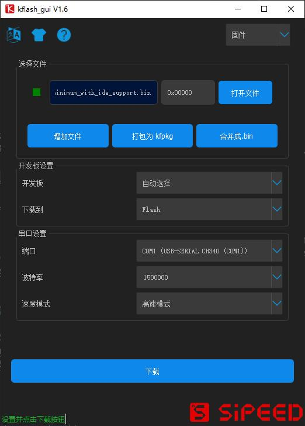

## Prepare

hardware:

- USB Type-C data cable
- MaixPy development board
- PC (computer)

software:

- MaixPy development board USB driver
- kflash_gui

## Confirm that the driver has been installed correctly

Install the driver according to the previous instructions, and you can see the serial device in the computer, `Linux` and `Mac OS` execute `ls /dev/` to see the device number, for example, the name is `ttyUSB0` and `ttyUSB1` ; `Windows` view in device manager


## Get the upgrade tool

* Download [kflash_gui](https://github.com/sipeed/kflash_gui/releases), you will get a compressed package
> kflash_gui is cross-platform and can work under multiple systems (including Windows, Linux, MacOS, and even Raspberry Pi)
> If you use Kendryte's `Windows` version, some development versions may not be able to download successfully, please use the `kflash_gui` software to download

* Unzip to a folder, double-click `kflash_gui.exe`(/`kflsh_gui`) to run, under `Windows`, it is recommended to right-click `fix to start page` or `fix to taskbar`, and create a new one under `Linux` A [kflash_gui.desktop](https://github.com/sipeed/kflash_gui/blob/master/kflash_gui.desktop), modify the file address, use the administrator to copy it to the `/usr/share/application` directory, and then You can see the application `kflash_gui` in the system menu interface

* You can also use the command line version to download

```shell
pip3 install kflash
kflash --help
kflash -p /dev/ttyUSB0 -b 1500000 -B goE maixpy.bin
```

## Get the firmware

* The released version of the firmware can be downloaded from the [github](https://github.com/sipeed/MaixPy/releases) page
* The latest submitted code is automatically constructed and generated firmware download: [master branch](http://dl.sipeed.com/MAIX/MaixPy/release/master/)


Files with firmware ending in `.bin` or `.kfpkg`
>`.kfpkg` is actually a packaged version of multiple `.bin` files, which can be packaged using `kflash_gui` or [manual packaging](http://blog.sipeed.com/p/390.html)


Firmware naming instructions:

| File name | Description | Remarks |
| --- | --- | --- |
| `maixpy_vx.y.z_x_xxx*.bin` | The default version of MaixPy firmware, contains most of the functions, supports connection to `MaixPy IDE`, | Factory default firmware version |
| `maixpy_vx.y.z_x_xxx*_m5stickv.bin` | Firmware customized for M5Stickv, supports connection to `MaixPy IDE` | — |
| `maixpy_vx.y.z_x_xxx*_with_lvgl.bin` | MaixPy firmware, supports connection to `MaixPy IDE`, with LVGL version. (LVGL is an embedded GUI framework, which is needed when writing interfaces) | — |
| `maixpy_vx.y.z_x_xxx*_minimum.bin` | MaixPy minimum set of firmware, does not support `MaixPy IDE`, does not include `OpenMV` related algorithms and various peripheral modules | — |
| `maixpy_vx.y.z_x_xxx*_minimum_with_ide_support.bin` | The smallest set of MaixPy firmware, supports connection to `MaixPy IDE`, does not include `OpenMV` related algorithms and various peripheral modules | Run various models, it is recommended to use this |
| `elf_maixpy_vx.y.z_x_xxx*.7z` | elf files, ordinary users don’t need to care, used for crash debugging | — |
| `face_model_at_0x300000.kfpkg` | Face model, placed at address 0x300000, can be downloaded separately from `.bin` for multiple downloads without conflict | — |


## Download the firmware to the development board

* Open the `kflash_gui` application

* Then select the firmware, setting options, and click to download. For more feature introduction and usage instructions, please refer to [kflash_gui project homepage](https://github.com/sipeed/kflash_gui)

When using, please note that the serial port cannot be occupied by other software, select the correct development board and serial port number, you can appropriately reduce the baud rate and use the low-speed mode to improve the download success rate




> For the earliest `Maix Go`, if you confirm that the options are correct and you still cannot download, you can try to turn the three-phase dial button to the `Down` position and keep downloading

### Sipeed RV JATG debugger

[Sipeed USB-JTAG/TTL RISC-V debugger STLINK V2 STM8/STM32 simulator](https://item.taobao.com/item.htm?spm=a1z10.3-c.w4002-21231188706.40.505a5d544ooyDY&id=595953803239 )


**FAQ of Programming FAQ**

If you are using `kflash_gui` to burn the following problems


You can check in the following order

* Check if the `PC` has permission to open the port. For `win10`, you need to run `kflash_gui` as an administrator.
* Check whether the port is selected correctly (if there are two device ports, usually choose the one with the smaller port number).
* Check whether the port is occupied by other applications (such as `Maixpy ​​IDE`, `putty`, etc.), and other applications should be closed.
* Check if the device is selected correctly. For `Maix Bit2.0` (including M1n module), `Maix Bit (with Mic )` should be selected.

> Supplementary note: Regarding the problem of Maix Bit 2.0 two serial ports
>
> * Only one of the serial ports is valid for serial communication and ISP download programs.
> * Maix Bit communicates with the PC through a serial port, through the CH552T chip to realize the USB virtual serial port function, and the chip can virtualize two serial ports, in Maix Bit (M1n module backplane), we only use one serial port, but some k210 products Both serial ports are used.
