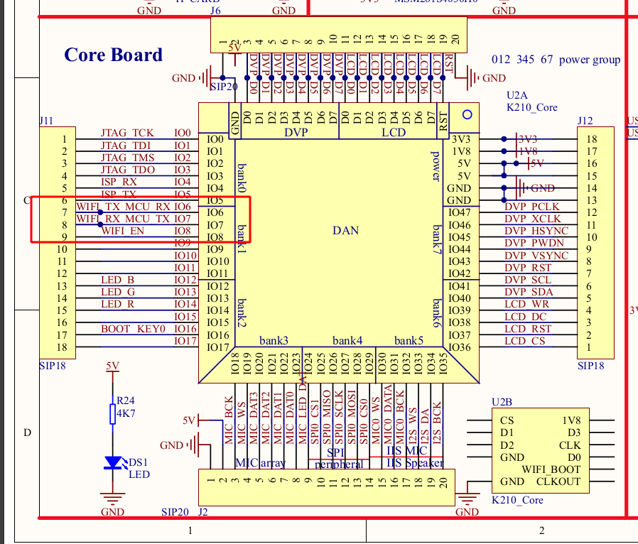
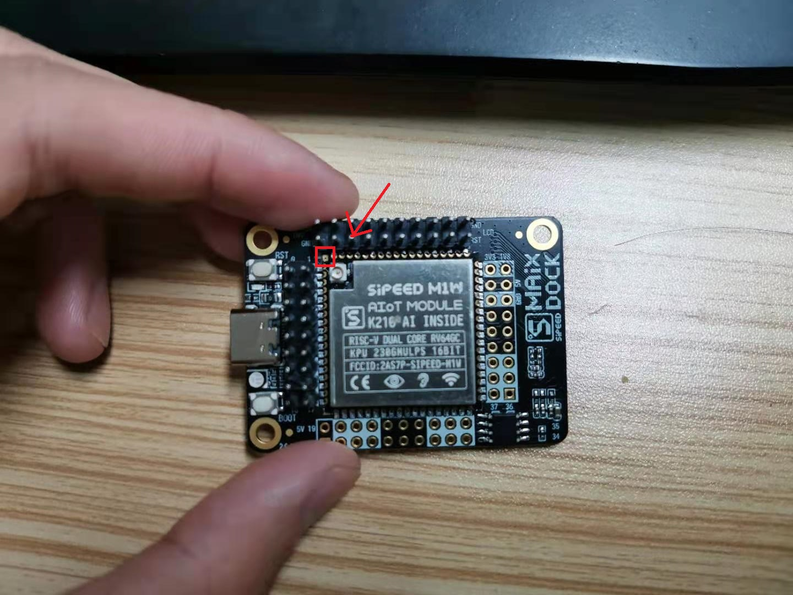
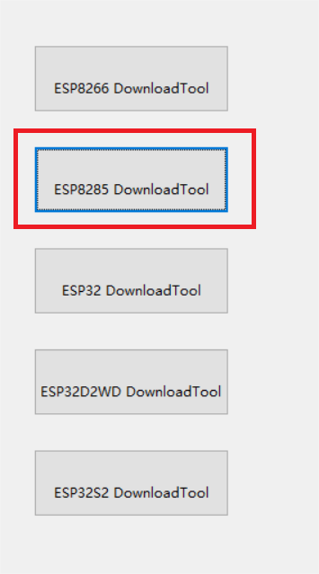
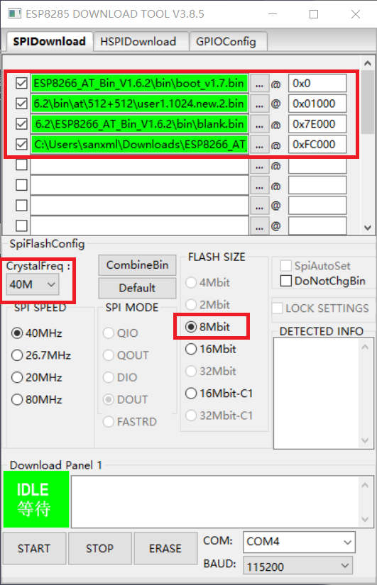

## 简介：

目前 MaixPy 系列采用 M1W 模块的作为核心模块的开发板有: MaixDock(M1W)， MaixGo

通常情况下我们不需要更新模块内部 WIFI SOC ESP8285 的固件，但是如果使用过程中存在 bug，以及有新版本的固件发布时我们就可以更新固件

> MaixDock、MaixGo 使用的 M1W 模块中的 ESP8285 默认烧录的是  AT 固件

## 验证 ESP8285 是否能够正常工作

- MaixPy 验证 ESP8285 是否正常工作例程

> [查看文本末尾例程](#maixpy-例程测试)

- 外接 USB 转串口模块测试

   使用 USB 转串口模块，按照下表连接之后上电

| M1W                                    | USB 模块 | 说明 |
| -------------------------------------- | -------- | ---- |
| M1W GND                                | GND      | 共地 |
| K210 (IO6)/ESP8285 TX                  | RX       | -    |
| K210 (IO7)/ESP8285 RX                  | TX       | -    |
| k210 RST(上电之前接地，全过程拉低 RST) | GND      | -    |

   上电之后板子会在串口输出(这里使用 XCOM, 波特率 115200) 来验证 ESP8285 是否正常启动
   


## AT 指令集

ESP8285 和 ESP8266 为同一系列产品，使用同一套 AT 指令集
ESP8285/ESP8266/ESP32 最新 AT指令集 https://github.com/espressif/esp-at/blob/v2.0.0.0_esp8266/docs/ESP_AT_Commands_Set.md


## 更新 ESP8285 固件步骤

在烧录 ESP8285 固件之前，先了解下 ESP8285 烧录原理:

### ESP8285 固件烧录原理

ESP8285 在上电时，会判断 boot stapping 管脚的状态，并决定启动(boot)模式, 如:

>  ets	Jan		8	2013,rst	cause:1,	boot	mode:(3,2)

其中打印的 boot mode 的第一位数字（3）代表当前的 boot 模式。
Boot 模式由 strapping 管脚的 3 位值 [GPIO15， GPIO0， GPIO2] 共同决定。如下表所
示：

| Strapping 管脚的 3 位值/[GPIO15， GPIO0， GPIO2] | Boot 模式            |
| ------------------------------------------------ | -------------------- |
| 7 / [1， 1， 1]                                  | SDIO HighSpeed V2 IO |
| 6 / [1， 1， 0]                                  | SDIO LowSpeed V1 IO  |
| 5 / [1， 0， 1]                                  | SDIO HighSpeed V1 IO |
| 4 / [1， 0， 0]                                  | SDIO LowSpeed V2 IO  |
| 3 / [0， 1， 1]                                  | Flash Boot           |
| 2 / [0， 1， 0]                                  | Jump Boot            |
| 1 / [0， 0， 1]                                  | UART Boot            |
| 0 / [0， 0， 0]                                  | Remapping            |


ESP8285 进入不同模式的 IO 电平请看如下表：

| 模式           | CH_PD(EN) | RST  | GPIO15 | GPIO0 | GPIO2 | TXD0 |
| :------------- | :-------- | :--- | :----- | :---- | :---- | ---- |
| UART 下载模式  | 高        | 高   | 低     | 低    | 高    | 高   |
| Flash 运行模式 | 高        | 高   | 低     | 高    | 高    | 高   |
| Chip 测试模式  | -         | -    | -      | -     | -     | 低   |

即 ESP8285 进入 UART 下载模式，启动信息 mode 第一位应该为 mode:(1, X)，如下：

>  ets	Jan		8	2013,rst	cause:1,	boot	mode:(1,1)


而以 MaixDock 为例，可以看到 MaixDock 原理图如下：




### 准备

> 这里以 MaixDock(M1W), Windows 10 系统为例

- 硬件: MaixDock, USB Type-C 数据线
- 软件:

- ESP 固件更新工具：ESP8285 **flash_download_tools**
  - 乐鑫官网下载链接：[**flash_download_tools**](https://www.espressif.com/zh-hans/support/download/other-tools)

- ESP8285 AT 固件：
 - 乐鑫官方下载链接: [espressif_esp8266-at](https://www.espressif.com/zh-hans/support/download/at?keys=&field_type_tid%5B%5D=14)

   

### Windows 使用 flash_download_tools 更新 ES8285（这里以 MaixDock 为例）：

1. 按照下面配置，连接 MaixDock,

    将 USB 转串口模块和ESP8285连接，连接方式前面已经介绍
    上电前 需要将 GPIO0 拉低，即将天线旁左上角的触点接地，进入 UART 下载模式。




1. 打开 **flash_download_tools**

2. 下载 **MaixDock ESP8285 固件**

    

3. 选择 ESP8285 串口(一般都是串口号比较大的)

4. 设置下载选项:

    如图配置相应选项, 注意**波特率一定要设置为 115200**

    

5. 点击 **Start** 更新固件，并等待完成更新

6. 验证更新是否完成

   - 使用 XCOM 波特率 115200, 打开 ESP8285 串口，输出 `AT\r\n`,如图提示 `OK` 即刷入成功
    

### LINUX 使用 esp_tool 更新 ES8285（这里以 MaixDock 为例）：

1. 按照下面配置，连接 MaixDock,

    

2. 安装 esptool

    ```shell
    pip3 install esptool
    ```

3. 下载 **MaixDock ESP8285 固件**

    ```shell
    ls /dev/ttyUSB* # 查看 USB 串口
    esptool --port /dev/ttyUSB0 write_flash 0x0 ESP8285-AT-V1.7.4_8Mbit_40Mhz.bin # 烧录固件
    ```

4. 验证更新是否完成

    使用串口工具， 波特率 115200, 打开 ESP8285 串口，输出 `AT\r\n`,如图提示 `OK` 即刷入成功
    


### MaixPy 例程测试：


```python
import network, time
from machine import UART
from Maix import GPIO
from fpioa_manager import fm

# En SEP8285 rst
#fm.register(8, fm.fpioa.GPIOHS0, force=True)
#wifi_en=GPIO(GPIO.GPIOHS0, GPIO.OUT)
#wifi_en.value(1)
# En SEP8285 rst
fm.register(0, fm.fpioa.GPIOHS0, force=True)
wifi_io15=GPIO(GPIO.GPIOHS0, GPIO.OUT)
wifi_io15.value(0)

fm.register(8, fm.fpioa.GPIOHS1, force=True)
wifi_en=GPIO(GPIO.GPIOHS1, GPIO.OUT)
wifi_en.value(1)

# for new MaixGO board, if not, remove it
#fm.register(0, fm.fpioa.GPIOHS1, force=True)
#wifi_io15_en=GPIO(GPIO.GPIOHS1, GPIO.OUT)
#wifi_io15_en.value(0)

fm.register(6, fm.fpioa.UART2_RX, force=True)
fm.register(7, fm.fpioa.UART2_TX, force=True)

uart = UART(UART.UART2,115200,timeout=1000, read_buf_len=4096)

def wifi_enable(en):
    global wifi_en
    wifi_en.value(en)

def wifi_deal_ap_info(info):
    res = []
    for ap_str in info:
        ap_str = ap_str.split(",")
        info_one = []
        for node in ap_str:
            if node.startswith('"'):
                info_one.append(node[1:-1])
            else:
                info_one.append(int(node))
        res.append(info_one)
    return res


#wifi_enable(0)
time.sleep(2)
nic = network.ESP8285(uart)

ap_info = nic.scan()
ap_info = wifi_deal_ap_info(ap_info)

ap_info.sort(key=lambda x:x[2], reverse=True) # sort by rssi
for ap in ap_info:
    print("SSID:{:^20}, RSSI:{:>5} , MAC:{:^20}".format(ap[1], ap[2], ap[3]) )


```
