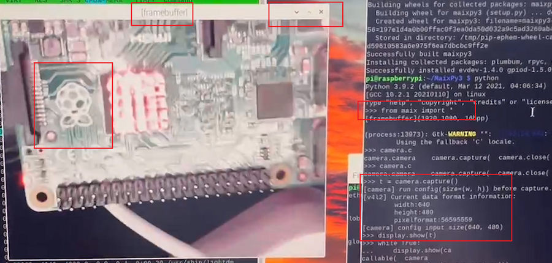
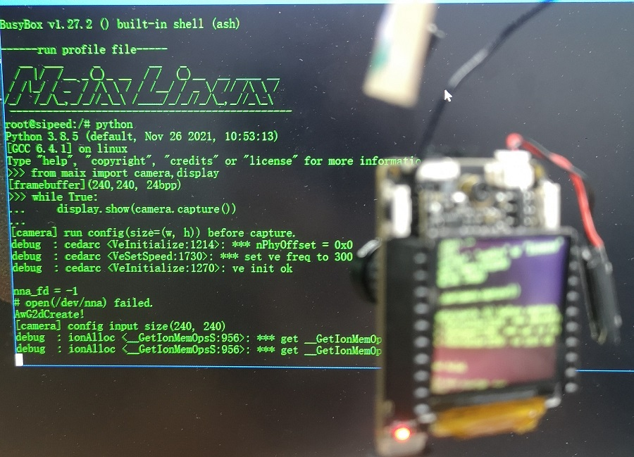
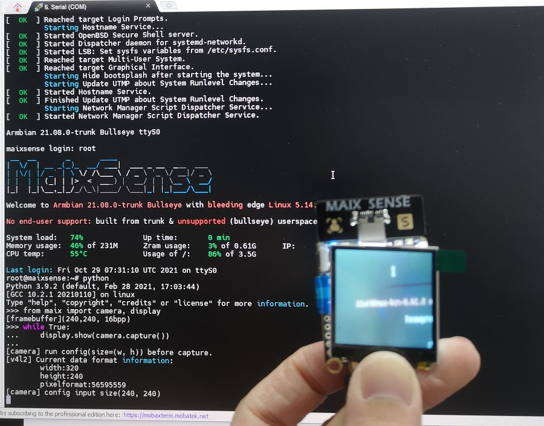

## 目前 MaixPy3 适配的平台

目前 MaixPy3 用于 Linux 平台，为用户提供了板子的 Python 编程基础模块、如摄像头、屏幕、I2C等传感器外设的用法、以及后续需要的图像处理、传统算法、AI 算法模块等相关功能模块，未来会陆续适配其他低端嵌入式芯片平台。

- [Linux Desktop](https://github.com/sipeed/MaixPy3)

- [MaixII-Dock](/hardware/zh/maixII/M2/resources.html)

- [MaixSense](/hardware/zh/maixII/M2A/maixsense.html)

> 2022年07月11日 MaixPy3 不支持 Windows MacOS Android 等操作系统。

## 在 Linux Desktop 上使用 pip3 安装 MaixPy3

> Linux Desktop 特指带桌面的 Linux 系统，如 ubuntu 、 debian 、Raspberry Pi OS 等。

先在终端执行下面命令来配置 MaixPy3 所需要的 libjpeg pybind11 gcc libopencv 等基础依赖库。

```bash
sudo apt update && sudo apt install libjpeg-dev gcc python3-pybind11 libopencv-dev -qq -y && wget http://mirrors.kernel.org/ubuntu/pool/main/libf/libffi/libffi6_3.2.1-8_amd64.deb && sudo apt install ./libffi6_3.2.1-8_amd64.deb -qq -y
```

然后安装或更新 maixpy3 依赖包。

```bash
pip3 install maixpy3 --upgrade
```

若是 MaixPy3 包安装后即可在终端运行代码检查版本号。

```python
juwan@juwan-n85-dls:~$ python3
Python 3.8.10 (default, Nov 26 2021, 20:14:08)
[GCC 9.3.0] on linux
Type "help", "copyright", "credits" or "license" for more information.
>>> import maix
>>> maix.
maix.nn       maix.signal   maix.version
>>> maix.version
'0.5.1'
>>>
```

可以接好摄像头设备(/dev/videoX)后，在设备上输入下面命令来测试拍照

```python
from maix import camera, display
display.show(camera.capture().draw_string(0, 0, "hello world!"))
```

下面为实拍图。


通常来说，像树莓派 2B 这类拥有桌面环境的 linux 设备也是可以通过 pip 进行安装 Linux Desktop 分支的，使用效果一样。



## MaixII-Dock (m2dock) 安装与更新 MaixPy3

MaixII-Dock 需要[烧录官方提供预置 MaixPy3 的 Openwrt 镜像](https://wiki.sipeed.com/hardware/zh/maixII/M2/flash.html)，你也可以手动 pip 安装更新 whl 软件包。



## MaixSense 安装 MaixPy3

MaixSense 需要[烧录官方提供预置 MaixPy3 的 Armbian 镜像](https://wiki.sipeed.com/hardware/zh/maixII/M2A/flash_system.html)，你也可以手动 pip 安装更新 whl 软件包。

```shell
root@maixsense:~# pip3 install maixpy3

Requirement already satisfied: maixpy3 in /usr/local/lib/python3.9/dist-packages (0.3.4)
Requirement already satisfied: Pillow in /usr/lib/python3/dist-packages (from maixpy3) (8.1.2)
Requirement already satisfied: zbarlight in /usr/local/lib/python3.9/dist-packages (from maixpy3) (3.0)
Requirement already satisfied: evdev in /usr/local/lib/python3.9/dist-packages (from maixpy3) (1.4.0)
Requirement already satisfied: spidev in /usr/local/lib/python3.9/dist-packages (from maixpy3) (3.5)
Requirement already satisfied: pyserial in /usr/local/lib/python3.9/dist-packages (from maixpy3) (3.5)
Requirement already satisfied: rpyc in /usr/local/lib/python3.9/dist-packages (from maixpy3) (5.0.1)
Requirement already satisfied: gpiod in /usr/local/lib/python3.9/dist-packages (from maixpy3) (1.5.0)
Requirement already satisfied: plumbum in /usr/local/lib/python3.9/dist-packages (from rpyc->maixpy3) (1.7.0)

root@maixsense:~# python #运行python
Python 3.9.2 (default, Feb 28 2021, 17:03:44)
[GCC 10.2.1 20210110] on linux
Type "help", "copyright", "credits" or "license" for more information.
>>> from maix import camera,display
>>> while True:
···    display.show(camera.capture())
```

输出以上信息则是代表安装好了，以下为实拍图。


## 其他 Linux 芯片平台

目前还没有精力适配其他平台的软件包，但大都不难适配，主要的适配工作量在 nn 模块（神经网络方面的接口），而其他都是通用的。
