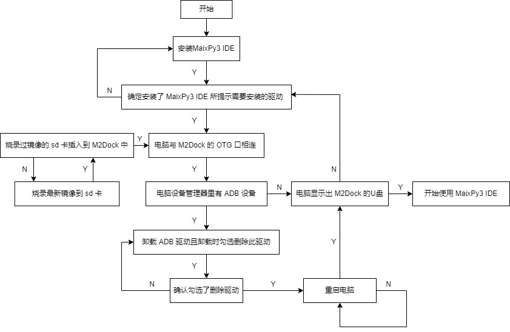
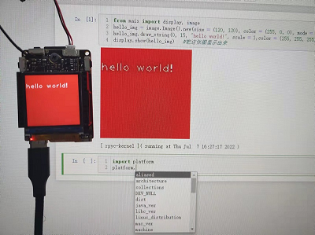
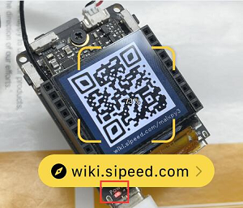
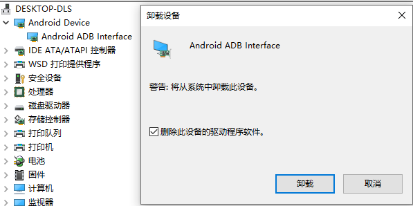
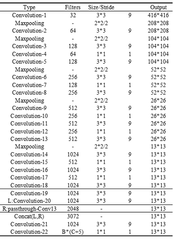

## 产品介绍

> 铛 ~ 新的 2023 年当然要有新的上手指南辣（虽然已经过去5个月）总有事情要被鸽但能填上就是好坑。
> 新的上手指南还是旧的目的，希望大家可以借助这篇文章在使用 M2DOCK 时更加顺利一点吧！


本篇文章以 `视觉` 为主题阐述如何在 M2DOCK（V831）从基础的开箱上手再到视觉的衍生（深度开发）的使用全过程，因篇幅的有限这里不再对产品进行详细介绍，想要了解相关产品介绍可点击资料进行查看。

- **相关资料及硬件参数：[点击查看](https://wiki.sipeed.com/hardware/zh/maixII/M2/resources.html) 购买链接：[点击前往](https://item.taobao.com/item.htm?id=635874427363)**

<iframe src="//player.bilibili.com/player.html?aid=298543445&bvid=BV1sF411u7xb&cid=586467021&page=1" scrolling="no" border="0" frameborder="no" framespacing="0" allowfullscreen="true"> </iframe>

## 前情提要

**【有基础可跳过】**促使我们做上手指南的原因永远都是以降低用户使用难度为目的，但一些基础知识（Python 语法）我们还是需掌握熟悉的，而大部分的小伙伴是从 `K210（MaixPy)` 换代升级到 `M2DOCK（MaixPy3)` 的，但我们区分这两者之间的不同吗？显然刚接触的小伙伴们是不清楚的。

>**我们可以这么来理解**：本质上它们都是专门为 AloT 提供的 Python 开发环境，提供了各类各样的模块。MaixPy 基于 MicroPython 的环境制作和 MCU 无系统的，而后者 MaixPy3 则是基于 Linux Python3 的环境以及 Linux 系统，可点击：[[关于 MaixPy 与 MaixPy3 的区别]](https://wiki.sipeed.com/news/MaixPy3/difference.html) 查看更多。

根据下文的链接自行学习相关的 Python 基础语法及知识：

- [什么是 Python ?](https://wiki.sipeed.com/soft/maixpy3/zh/origin/python.html?highlight=python)
- [国内 Python 基础教程](https://wiki.sipeed.com/soft/maixpy3/zh/origin/video.html)
- [【适合有一定基础】大佬鼠の嵌入式 Python 入门教程[1]](https://wiki.sipeed.com/soft/maixpy3/zh/origin/hello_world.html)
- [【适合有一定基础】大佬鼠の嵌入式 Python 入门教程[2]](https://wiki.sipeed.com/soft/maixpy3/zh/origin/loop_python.html)

## 准备工作（必看）

充足的准备能让后续的上手旅程更事半功倍（为了不掉坑里~）文档以 `M2DOCK` 的全功能套餐来演示，我们收到后会有一套 M2DOCK 板卡、Type-C 线 以及 SD 镜像卡，但还需准备一个 USB 3.0 读卡器以作备用。


### 上手流程图

上手指南搭配流程图一起食用更佳~



### 烧录镜像系统

准备完相关的硬件工具后就是开启软件类的的相关准备操作，我们先进行烧录 M2DOCK 相关的适配系统。

> 文档示例环境：**Windows10**    
> 镜像版本：**v831-m2dock-maixpy3-0.5.4-20230505**
> 1. 在官方淘宝店购买过（预烧录好）镜像 SD 卡的小伙伴可跳过进入下一步。
> 2. 如果没有购入官方相关镜像卡，建议用户购买正规正版（防止出现烧录失败现象）的镜像卡。
> 3. 非必要的情况下不建议多次且随意进行镜像烧录。

- **镜像文件命名说明**

对于 V831 的镜像文件名字是有对应的规则，以后大家可以根据自己的需求来进行下载。
就以 `v831-m2dock-maixhub-0.5.1-20220701.zip`和 ` v831-m2dock-maixpy3-0.5.1-20220701.zip` 来对比说明

| 名称          | 含义                                                                                                              |
| ------------- | ----------------------------------------------------------------------------------------------------------------- |
| maixpy3-0.5.1 | 此镜像是给 [MaixPy3](https://wiki.sipeed.com/maixpy3) 专用，并内置了`0.5.1`的版本，但其中 **无** 内置 maixhub app |
| maixhub-0.5.1 | 此镜像是给 [MaixPy3](https://wiki.sipeed.com/maixpy3) 专用，并内置了`0.5.1`的版本，但其中 内置 maixhub app        |
| m2dock        | 可使用 MaixII-Dock 开发板平台                                                                                     |
| 20220701      | 镜像更新日期                                                                                                      |

> 上述镜像均为开源版，只适用于 TF 卡烧录启动

- **获取相关的镜像包及工具**

1. V831 系统镜像下载站 [SDK_MaixII/release](https://dl.sipeed.com/shareURL/MaixII/MaixII-Dock/SDK/release) 
2. V831 系统镜像百度云 [点我 提取码：v831](https://pan.baidu.com/e/verify?surl=Yrqpk26BL3sOCm4P1cMpBQ)
3. 烧录工具 [PhoenixCard](https://dl.sipeed.com/shareURL/MaixII/MaixII-Dock/SDK/tools)
4. 内存卡格式化工具 [SD Card Formatter](https://www.sdcard.org/downloads/formatter/eula_windows/SDCardFormatterv5_WinEN.zip)

- **开始进行烧录工作**

**第一步**：先使用读卡器将镜像卡接入 USB 端，使用格式化工具 `SD Card Formatter` 进行格式化操作。
**第二步**：格式化完成后，再使用 `PhoenixCard` 烧录工具进行烧录。
**烧录流程示例**：可前往 [Windows/Linux M2dock 系统烧录](https://wiki.sipeed.com/hardware/zh/maixII/M2/flash.html) 查看相关示例，下图显示绿色代表烧录成功。


系统相当于燃机的原料，我们把系统烧录完成好后接着下一步安装需使用到的软件。

### 安装 MaixPy3 IDE 

`MaixPy3 IDE` 是基于 `Jupyter` 实现的 `Python3` 集成开发环境，运行界面可视化的操作降低使用难度，支持电脑端（支持跨平台）编辑或运行 Python 代码并实时显示效果，故而对无相关基础的用户们较友好。



> `注意事项（超重要！）`：**下载时确保我们安装的软件包版本（大于 0.5.0）且在安装过程中会弹出安装驱动程序的提示，请根据提示安装驱动并确保安装完成才能进行下一步操作。**


接下来根据 `注意事项` 来自行下载安装包并安装好驱动及软件，根据示例文档熟悉界面的基础用法。

- **软件包下载链接：**

MaixPy3 IDE 下载站：[点击](https://dl.sipeed.com/shareURL/MaixII/MaixPy3-IDE) 
MaixPy3 IDE 百度云：[点击](https://pan.baidu.com/s/1d5zbIDSOBUvIta_rRhLx_A)
  
- **示例文档：**

多平台安装 MaixPy3 IDE 方法：[Windows/Macos/Linux MaixPy3 IDE](https://wiki.sipeed.com/soft/maixpy3/zh/tools/MaixPy3_IDE.html)
软件使用文档：[MaixPy3 IDE 界面介绍](https://wiki.sipeed.com/soft/maixpy3/zh/tools/MaixPy3_IDE.html#MaixPy3-IDE-%E7%95%8C%E9%9D%A2%E4%BB%8B%E7%BB%8D)

> 一起搭配我们的【M2DOCK 开箱大放送】视频食用更佳噢~
<iframe src="//player.bilibili.com/player.html?aid=384617683&bvid=BV14Z4y147Lg&cid=734640023&page=1" scrolling="no" border="0" frameborder="no" framespacing="0" allowfullscreen="true"> </iframe>

### 上电接线方式

准备好相关的软件以及基础工作我们开始学习如何正确接线并上电。

**第一步**：USB Type-C 数据线【需自行准备的话】请准备质量可靠或者是手机附赠的数据线，质量差的数据线会因电压问题造成开发板处于非正常工作状态导致后续影响使用，有些 Type-C 线只能供电。


**第二步**：把我们准备的镜像卡插入 M2DOCK 的卡槽内，并确定烧录的版本（大于 0.5.1）即可。


**第三步**：将 `M2DOCK` 与电脑通过 OTG 标识的 USB 口连接，确认设备通电亮起（power）电源**红灯**，请看下图红圈别接错 USB 口的位置，OTG 标识的丝印在板子背面。



**第四步**：确认屏幕出现 logo 或二维码（wiki）表示系统启动开始工作，同时电脑会弹出 U 盘标识（意味着板卡系统已准备就绪）即可进行下一环开始使用！


> **如果出现异常情况**：通电后无法弹出 U 盘标识（常见于 Windows 平台）根据第五步卸载相关驱动即可。

**衍生第五步**：打开设备管理器后，根据示例图找到相关的 `Android ADB Interface` 手机驱动（常见于 XX 手机助手）右键进行卸载设备。


然后勾选卸载驱动（重要！！一定要勾选）进行卸载即可，U 盘自动弹出也代表底层硬件正常可用。



> 如果 U 盘还是没有如上述步骤出现，可以重烧系统或重启设备或考虑换台电脑操作，有可能是个别系统驱动不兼容导致的，实在是解决不了请找官方的淘宝客服。

## 上手运行程序

> 这里后不再重复任何基础操作知识，默认大家会操作 [Jupyter](https://wiki.sipeed.com/soft/maixpy3/zh/tools/0.MaixII-Dock.html#%E9%80%89%E6%8B%A9-RPyc-Python-%E6%A0%B8%E5%BF%83%E8%A1%A8%E7%A4%BA%E5%9C%A8%E6%9D%BF%E5%AD%90%E4%B8%8A%E8%BF%90%E8%A1%8C-Python-%E7%A8%8B%E5%BA%8F) 相关运行界面及方法。

开始体验运行代码前，我们先了解 M2DOCK 支持多种编程方式，分别是 Linux shell（adb）命令行、Jupyter notebook（Python）开发、U 盘编辑运行（Python）等。Linux shell 更多的是专业开发者或是熟悉 Linux 终端的同学进行使用，而如果是无基础的萌新更推荐其余两种方式。

>下文全以适配软件 MaixPy3 IDE 的使用来示例。

- **先熟悉相关的运行环境**

IDE 软件启动时会附带一个 `keep_adb.exe` 命令行终端的程序提供给熟悉 linux 终端操作开发板的同学，软件版本 0.4.2 后 keep_adb 服务会自动调用 adb 配置映射（forward）端口（22，18811，18812）与板子连接的 ide 服务是否工作。

**如何进行判断**：可以在交互终端输入 `ps | grep mjpg` 查看是否存在下图红框所指示的服务。


> 如果发现不存在 ide 服务（`python -c 'from maix import mjpg;mjpg.start();`）我们可以手动运行相关服务，并把现象汇报到社群，目前发现该现象主要出现在 Windows 11 系统之间的差异上。

最后确认系统防火墙是否阻止了软件底层所需要 `TCP 18811 18812` 的端口号（主用于运行程序和图像传输）

**了解更多**：可以点此查看关于 [MaixPy3](https://wiki.sipeed.com/soft/maixpy3/zh/tools/MaixPy3_IDE.html) IDE 的更加详细的介绍，此处不再赘述。

> **启动 MaixPy3 IDE 时会弹出 Jupyter 的编辑网页，我们先来测试板卡的连接以及外设是否正常可用。**

### 测试板卡连接

复制下列代码块，再点击上方菜单栏中的运行，测试板子连接是否正常。

```python3
import platform
print(platform.platform())

import time
print(time.asctime())
```


**由运行后打印出的结果我们可知以下信息：**

1. 运行这段代码的时间是 [ rpyc-kernel ]( running at Wed Jul 13 15:20:20 2022 )
2. 运行这段代码的平台是 Linux-4.9.118-armv7l-with-libc
3. 运行这段代码时：板子系统时间是 Thu Jan 1 04:04:55 1970。

当代码运行的时间为当前时间，并打印出以上代码，说明开发板已经连接上并可以正常的使用。

> 关于更详细或报错的话请查看 [如何运行代码](https://wiki.sipeed.com/soft/maixpy3/zh/tools/0.MaixII-Dock.html#%E5%A6%82%E4%BD%95%E8%BF%90%E8%A1%8C%E4%BB%A3%E7%A0%81) 进行排查或了解。

### 测试屏幕及摄像头

> 当确定板卡的连接状态正常后，我们来测试屏幕以及摄像头的功能是否正常。

运行以下程序后可在代码下方看见摄像头实时获取的图像。

```python3
from maix import camera, display, image #引入python模块包

while True:
    img = camera.capture()    #从摄像头中获取一张图像
    display.show(img)         #将图像显示出来
```


图中我们看见运行程序后可实时看到摄像头捕捉的画面，正面我们的屏幕以及摄像头都是正常可用的。

>更多的图像处理基础用法：[查看](https://wiki.sipeed.com/soft/maixpy3/zh/usage/vision/maixpy3-example.html#%E4%BB%8E%E6%91%84%E5%83%8F%E5%A4%B4%E8%8E%B7%E5%8F%96%E5%9B%BE%E5%83%8F%E5%B9%B6%E6%98%BE%E7%A4%BA)

### 测试拍照功能

```python
from maix import camera, display, image 
display.show(camera.capture())
```


> **如果屏幕没有显示内容**：那么首先确认一下镜像镜像版本，并且确认一下外设和驱动对的上。

## 基础使用

上文我们使用了 Maixpy3 IDE 搭载的 **Jupyter（Python）**运行代码并测试了屏幕及摄像头的功能，接下来我们来体验 Linux shell 命令行的使用并给 M2DOCK 进行联网。

>命令行也就是所谓的 Linux Shell 还是用户使用 Linux 的桥梁，Shell 是指一种应用程序，这个应用程序提供了操作界面，用户通过这个界面访问操作系统内核的服务，使用 shell 需要使用者具备一定的 Linux 基础知识 [Shell 教程](https://www.runoob.com/linux/linux-shell.html)/[部分常用 Linux 命令](https://wiki.sipeed.com/hardware/zh/maixII/M2/usage.html#%E9%83%A8%E5%88%86%E5%B8%B8%E7%94%A8-Linux-%E5%91%BD%E4%BB%A4)可根据需求进行学习。

### 联网

M2Dock 带有 2.4G 无线模组，可以用来连接 2.4G 频段的无线网络，因镜像的更新（WiFi）链接方式有两种可供大家选择，但是文档示例以最新镜像方法为示例标准，更多可查询下文给出的参考链接。

- **使用以下命令行进行联网 确保镜像系统：0.5.4（20230207）**

使用下面的命令来连接名称：`Sipeed_Guest` 密码：`qwert123` 的无线网络。

```
wifi_connect_ap_test Sipeed_Guest qwert123
```


连接成功后可使用 `ifconfig` 命令查询 `wlan0` 的 IP 地址，更多命令行联网的详情请看[ V0.5.4 联网.](https://wiki.sipeed.com/hardware/zh/maixII/M2/usage.html#V0.5.4)

- **修改 wpa_supplicant.conf 进行联网：（V0.5.4）前镜像**

这个办法适用于 V0.5.4 前的镜像系统，通过修改 U 盘里的 `wpa_supplicant.conf` 文件修改名称及密码来联网，更加具体的操作请看[ V0.5.4 前镜像联网](https://wiki.sipeed.com/hardware/zh/maixII/M2/usage.html#V0.5.4-%E4%B9%8B%E5%89%8D%E7%9A%84%E9%95%9C%E5%83%8F) 相关资料。

### 配置开机脚本

>上文我们尝试了怎么使用 Linux shell 来进行联网操作，这里我们来尝试使用 U 盘配置开机脚本。

**对于 M2DOCK 如何使用 U 盘设置开机脚本呢？其实很简单只需要一下几个步骤：**

**第一步**：把（待存）脚本存成名为 `main.py` 的文件，然后根据第二步判断存放位置。
**第二步**：判断 U 盘目录下是否有 app 的文件夹，如果有就把 `main.py` 存进 `app` 文件夹后进行下一步，如果没有直接把 `main.py` 存放在 U 盘即可进行下一步。
**第三步**：存放好后使用电脑操作系统自带的移除 U 盘方式来保证文件在没有损坏的情况下保存进板卡，否则会因为不当操作而导致 `main.py` 没有正常保存到 U 盘（板卡系统）里面。

>**注意事项：MaixPy3 IDE 运行时会停止 M2Dock 的开机脚本程序，所以我们应该在电脑托盘找到并退出 MaixPy3 IDE 或者选择仅使用板子上的 TypeC 串口来进行供电以查看开机运行脚本效果。**

以下为 root 目录下 main.py 文件里的出厂默认开机脚本：

```python
#!/usr/bin/env python
from maix import camera, display, image, nn
image.load_freetype("/home/res/sans.ttf")
qrcode = image.open('/home/res/qrcode.png')
canvas = image.new((display.width(), display.height()), (0xFF, 0xFF, 0xFF), "RGB")
canvas.draw_image(qrcode, (canvas.width - qrcode.width) // 2, (canvas.height - qrcode.height) // 2)
info = "wiki.sipeed.com/maixpy3"
w, h = image.get_string_size(info, 1.2)
canvas.draw_string((canvas.width - w) // 2 + 5, canvas.height - h - 5, info, 1.2, color=(0x00, 0x00, 0x00))
for i in range(120):
    img = camera.capture().draw_image(canvas, alpha=0.7)
    display.show(img)
```


> 上手里不再关于开机脚本有关于更多的 [配置开机脚本](https://wiki.sipeed.com/soft/maixpy3/zh/tools/0.MaixII-Dock.html#%E9%85%8D%E7%BD%AE%E5%BC%80%E6%9C%BA%E5%90%AF%E5%8A%A8%E8%84%9A%E6%9C%AC) 的详情资料可前往查看。
> 如何退出 MaixPy3 IDE：[操作流程](https://wiki.sipeed.com/soft/maixpy3/zh/tools/0.MaixII-Dock.html#%E5%A6%82%E4%BD%95%E9%80%80%E5%87%BA-MaixPy3-IDE) 可前往查看。

### 传输文件

在使用 U 盘进行传输文件之前我们需要先了解电脑端 U 盘的目录与 M2DOCK 文件系统目录的对应规则。

>规则：电脑上的 U 盘对应着 M2DOCK 文件系统的 /root 目录。

传输文件操作如下：（前提 M2DOCK 通过 OTG 口连接电脑端）

**第一步**：将文件拖拽进 U 盘后相当于完成存储到 M2DOCK 系统上的操作。
**第二步**：存储后务必使用电脑系统自带的 U 盘移除相关的功能来断开电脑与 U 盘的通信。
**第三步**：最后进行重启（按下 RST 键或者重新插拔 USB）来使 m2dock 再次重新加载文件系统，否则会因为板卡与电脑非正常断开通信而导致文件系统损坏，保存失败。

### 图像处理

通过上文我们清楚了如何使用 Python 运行程序、如何使用 Linux shell 进行联网以及使用 U 盘设置开机脚本，熟悉的朋友们都知道 MAIX 系列主打的就是视觉 + AI 芯片，那图像处理是我们必不可少的体验过程。

>图像处理还分传统以及 AI 视觉，而在 M2dock 上我们主要学习传统的背景知识以及用法。

**传统视觉背景知识**：[点击前往](https://wiki.sipeed.com/soft/maixpy3/zh/usage/vision/back-information.html)
我们需要了解图像传感器-摄像头、以及颜色空间和坐标系统的相关知识，方便后续在体验用法时更好理解。

**MaixPy 基础使用示例**：[点击前往](https://wiki.sipeed.com/soft/maixpy3/zh/usage/vision/maixpy3-example.html)
这里涵盖了一些基础使用（画线圈框）还有传统视觉应用（寻迹寻色寻线阈值处理）的示例。

**传统图像处理模块**：[点击前往](https://wiki.sipeed.com/soft/maixpy3/zh/usage/vision/image_example.html)
这里涵盖了传统视觉、颜色统计追踪、标记追踪、图像滤波、特征检测等模块使用的示例。

### 硬件外设

这个章节更多的讲述的是认识一些经典外设并学会使用调用它的示例。

1. [【GPIO】](https://wiki.sipeed.com/soft/maixpy3/zh/usage/hardware/GPIO.html)在？点个灯用个按键。
2. [【I2C】](https://wiki.sipeed.com/soft/maixpy3/zh/usage/hardware/I2C.html)如何连接以及使用 I2C。
3. [【PWM 脉冲宽度调制】](https://wiki.sipeed.com/soft/maixpy3/zh/usage/hardware/PWM.html)关于 PWM 的基础使用以及深入了解示例。
4. [【UART】](https://wiki.sipeed.com/soft/maixpy3/zh/usage/hardware/UART.html)认识定义并学会使用 UART 进行传递字符串。
5. [【SPI】](https://wiki.sipeed.com/soft/maixpy3/zh/usage/hardware/SPI.html)熟悉 SPI 的基础使用以及如何驱动 WS2812B 灯珠。
6. [【EVENT】](https://wiki.sipeed.com/soft/maixpy3/zh/usage/hardware/event.html)如何通过输入事件设备来检测外接设备的变化。
7. [【ADC】](https://wiki.sipeed.com/soft/maixpy3/zh/usage/hardware/ADC.html)了解相关的 ADC 通讯协议并实现旋钮控制、触控测试等。
8. [【WATCHDOG 看门狗】](https://wiki.sipeed.com/soft/maixpy3/zh/usage/hardware/watchdog.html)了解看门狗的相关原理并实现它。

### 网络应用

**Python3 网络应用**：[点击前往](https://wiki.sipeed.com/soft/maixpy3/zh/usage/net.html)

这一章是相关的 Python 网络应用的一些示例以及库的使用方法，讲述了上云需了解的 HTTP/MQTT 相关的定义基础知识（网络应用不代表联网，联网请看同级目录第一个）以及如何进行 MJPG 图传。

### 媒体功能

这一章节讲述的是在 M2DOCK 上如何实现播放视频以及录音播放的使用示例。

**播放视频**：[点击前往](https://wiki.sipeed.com/soft/maixpy3/zh/usage/Audio/play_mp4.html)
**录音与播放**：[点击前往](https://wiki.sipeed.com/soft/maixpy3/zh/usage/Audio/audio.html)

## 进阶使用

> 到达进阶使用这里后，这里则需要小伙伴们具备一些 Linux 基础了才能继续往下走学习。

### 认识 openwrt 系统

全志 V831 使用 Tina Linux 系统移植自 OpenWrt。

OpenWrt 可以被描述为一个嵌入式的 Linux 发行版，详情可看 [官方网址](https://openwrt.org) 和 [官方开源仓库](https://github.com/openwrt/openwrt)。

**更多相关的详情点击**：[详情资料](https://wiki.sipeed.com/hardware/zh/maixII/M2/usage.html#%E8%AE%A4%E8%AF%86-openwrt-%E7%B3%BB%E7%BB%9F)

### Opkg 包管理器

Opkg 是一个轻量快速的套件管理系统，目前已成为 Opensource 界嵌入式系统标准。常用于 路由、交换机等 嵌入式设备中，用来管理软件包的安装升级与下载。

**相关的常用命令**：[点击查看](https://wiki.sipeed.com/hardware/zh/maixII/M2/usage.html#Opkg-%E5%8C%85%E7%AE%A1%E7%90%86%E5%99%A8)

[pip](https://pypi.org/project/pip/) 是 Python 包管理工具，该工具提供了对 Python 包的查找、下载、安装、卸载的功能。

**如何使用示例**：[点击查看](https://wiki.sipeed.com/hardware/zh/maixII/M2/usage.html#pip-%E5%8C%85%E7%AE%A1%E7%90%86%E5%99%A8)

### 更新 MaixPy3 包

有时镜像包更新但我们确不想再次进行烧录板子以作更新，这时可以手工更新 MaixPy3 达到更新目的。

**MaixPy3 最新安装包**：[点击前往下载](https://pypi.org/project/maixpy3/#history)
**Maixpy3 更新操作**：[操作示例](https://wiki.sipeed.com/soft/maixpy3/zh/tools/0.MaixII-Dock.html#%E6%9B%B4%E6%96%B0-MaixPy3-%E5%8C%85)


### 使用 USB 摄像头（主机模式）

>M2DOCK 是双 Type-c 接口的（分别是 UART/OTG）而 OTG 接口是默认作为 USB 从机来使用的。

如果想使用 USB 摄像头则需手动更改端口为主机模式，从板子上的串口 USB（UART）来操作板子，并执行以下命令修改 OTG 口为主机模式使用。

```shell
echo "usb_host" > /sys/devices/platform/soc/usbc0/otg_role
```

### 将 USB OTG 口作为从机

M2Dock 默认的 OTG 口就是 USB 从机设备，如有其他原因需重新设置成从机设备的话，只需在 M2DOCK 上执行以下命令即可。

```shell
echo "usb_device" > /sys/devices/platform/soc/usbc0/otg_role
```

### 更换屏幕

目前开发板支持的屏幕有 1.3寸、2.4寸、2.8寸 的 IPS 屏，且只是支持在我们淘宝上售卖的显示屏；对于别的屏幕有需求的，可以走商务通道进行定制。

**如何进行屏幕的切换及更新设备树**：[点击查看](https://wiki.sipeed.com/hardware/zh/maixII/M2/other.html#%E5%88%87%E6%8D%A2%E5%B1%8F%E5%B9%95)

### 更换摄像头

目前 MaixII-Dock 开发板目前支持的摄像头有 sp2305、vs3205、ov2685（只支持在官方店上再售卖的摄像头，有别的摄像头需求可以进行商务定制），摄像头之间的切换同样时需要更换设备树文件，更换方式上面的更换屏幕一样的。

**如何进行摄像头以及设备树的切换**：[点击查看](https://wiki.sipeed.com/hardware/zh/maixII/M2/other.html#%E6%9B%B4%E6%8D%A2%E6%91%84%E5%83%8F%E5%A4%B4)

### 编译链

有需求的可以自行尝试，但是对于 V831 还是推荐使用 MaixPy3 和 MaixHub。

**Linux 系统下 V831 使用编译链**：[toolchain-sunxi-musl-pack-2021-01-09.tar.xz](https://dl.sipeed.com/shareURL/MaixII/MaixII-Dock/SDK/Toolchain)

## 使用文档（资源）

无论是在 K210 还是 M2DOCK（V831）上一定要学会使用我们公开的文档资料，去借助资料的力量帮助自己在学习的道路上往前走，学会借助资源完善自身的不足，可以让你少走很多的坑以及弯路。

1. 学会搜索并利用官方的 `文档社区` 以及 `github issue` 资源，会让新手小白少走很多弯路雷坑。
2. 文档资源在 `常见问题 FAQ` 中基本涵盖了所有的坑，使用途中报错可以先查看排错。
3. 想要实现更多的功能示例或需要更多的脚本源码，可前往 MaixPy3 的源码例程仓库查找。

**文档搜索例程**：[点击查看](https://wiki.sipeed.com/soft/maixpy/zh/how_to_read.html)
**BBS 社区教程贴**：[点击前往](https://bbs.sipeed.com/thread/492)
**MaixPy3 源码仓库**：[点击前往](https://github.com/sipeed/maixpy3)
**MaixPy3 issue**：[点击前往](https://github.com/sipeed/MaixPy3/issues)
**MaixPy3 常见问题指南**：[点击前往](https://wiki.sipeed.com/soft/maixpy3/zh/tools/0.MaixII-Dock.html#%E5%B8%B8%E8%A7%81%E9%97%AE%E9%A2%98%E6%8C%87%E5%8D%97)
**V831 源码**：[点击前往](https://github.com/Tina-Linux/tina-V83x)
**V83 工具链**：[点击前往](https://dl.sipeed.com/shareURL/MaixII/MaixII-Dock/SDK/Toolchain)
**V831 常见问题与解决方法**：[点击前往](https://wiki.sipeed.com/soft/maixpy3/zh/question/maixpy3_faq.html)
**BBS 社区常见问题汇总贴**：[点击查看](https://bbs.sipeed.com/thread/489)
**相关社群汇总贴**：[点击查看](https://wiki.sipeed.com/community.html)

### 更多资源（教程文章）

这里的文章大多数是来自社区以及博文精选，可供参考。

1. **MaixPy3 Image.lens_corr 畸变矫正的用法**：[点击前往](https://wiki.sipeed.com/news/MaixPy3/camera_lens_corr/v831_lens_corr.html)
2. **给 M2Dock 安装 Opencv**：[点击前往](https://wiki.sipeed.com/news/others/v831_opencv/v831_opencv.html)
3. **使用 SSH 来连接 M2Dock**：[点击前往](https://wiki.sipeed.com/news/others/831_ssh/831_ssh.html)
4. **在线图传调试 LAB 阈值**：[点击前往](https://wiki.sipeed.com/news/others/threshold/threshold.html)
5. **MaixPy3 Image.resize 的效果**：[点击前往](https://wiki.sipeed.com/news/MaixPy3/camera_resize/camera_resize.html)
6. **MaixII 通过 USB OTG 口连接U盘**：[点击前往](https://wiki.sipeed.com/news/others/maixII_connect_udisk.html)
7. **在V831上（awnn）跑 pytorch resnet18 模型**：[点击前往](https://wiki.sipeed.com/news/others/v831_resnet18/v831_resnet18.html)
8. **V831 如何使用 libmaix SDK C++ 开发**：[点击前往](https://wiki.sipeed.com/news/MaixPy3/run_lvgl/run_lvgl.html)
9. **V831完美的单目测距**：[点击前往](https://wiki.sipeed.com/news/MaixPy3/v831_Distance/v831_Distance.html)
10. **V831的人脸识别**：[点击前往](https://wiki.sipeed.com/news/MaixPy3/key_face_recognize.html)

## 体验 AI 应用

上文我们说过了 MAIX 系列主打的就是 视觉 + AI 的特性，所以 AI 算法应用也是上手体验里不可少的一环。

- [边缘检测](https://wiki.sipeed.com/soft/maixpy3/zh/usage/AI_net/Edge_detection.html)
- [物品分类](https://wiki.sipeed.com/soft/maixpy3/zh/usage/AI_net/resnet.html)
- [物体检测](https://wiki.sipeed.com/soft/maixpy3/zh/usage/AI_net/yolo.html)
- [数字识别](https://wiki.sipeed.com/soft/maixpy3/zh/usage/AI_net/number_recognize.html)
- [人脸识别](https://wiki.sipeed.com/soft/maixpy3/zh/usage/AI_net/face_recognize.html)
- [自学习分类](https://wiki.sipeed.com/soft/maixpy3/zh/usage/AI_net/self_learn.html)
- [车牌识别](https://wiki.sipeed.com/soft/maixpy3/zh/usage/AI_net/car_registration_plate_recognition.html)

## 训练 AI 模型

>训练自己的 AI 模型有两种方法：分别是在线训练以及本地训练。

**在线训练**：则是指适配了 MaixPy3 的 MaixHub 在线训练平台，还有支持的相关设备端镜像，更多详细资料请前往 [相关使用](https://maixhub.com/app/1)查看。

**本地训练**：则是不依靠任何在线训练平台，自行了解相关知识并进行环境搭建、制作数据集、训练相关模型。

相关资料教程文档：
1. [深度神经网络（DNN）基础知识](https://wiki.sipeed.com/soft/maixpy3/zh/usage/train_AI/information.html)
2. [本地训练环境搭建](https://wiki.sipeed.com/soft/maixpy3/zh/usage/train_AI/ready.html)
3. [v831 部署 Sobel 卷积边缘检测](https://wiki.sipeed.com/soft/maixpy3/zh/usage/train_AI/v831_sobel.html)
4. [如何制作数据集](https://wiki.sipeed.com/soft/maixpy3/zh/usage/train_AI/data.html)
5. [图像分类模型训练过程](https://wiki.sipeed.com/soft/maixpy3/zh/usage/train_AI/train_resnet.html)
6. [目标检测本地训练教程](https://wiki.sipeed.com/soft/maixpy3/zh/usage/train_AI/train_yolov2.html)

## 核心 API 手册

这个章节可以搭配下文的编译与开发一起食用更佳噢~

- [MaixPy3 image 模块](https://wiki.sipeed.com/soft/maixpy3/zh/api/maix/image.html)
- [MaixPy3 display 模块](https://wiki.sipeed.com/soft/maixpy3/zh/api/maix/display.html)
- [MaixPy3 camera 模块](https://wiki.sipeed.com/soft/maixpy3/zh/api/maix/camera.html)
- [MaixPy3 nn模块（maix.nn）](https://wiki.sipeed.com/soft/maixpy3/zh/api/maix/nn.html)

## 编译与开发

> 当你走到这时已经代表你熟悉（V831）的基础操作准备深层了解，以下的文档是为了开发者写的参考文，希望可以基于此让更多的伙伴进入 Linux 嵌入式开发的领域。

**相关资料系列合集：**

1. [MaixPy3 架构介绍](https://wiki.sipeed.com/soft/maixpy3/zh/others/framework.html)
2. [MaixPy3 开发文档](https://wiki.sipeed.com/soft/maixpy3/zh/others/develop.html)
3. [如何适配你的平台](https://wiki.sipeed.com/soft/maixpy3/zh/others/platform.html)
4. [MaixPy3 视觉模块开发](https://wiki.sipeed.com/soft/maixpy3/zh/develop/opmv_cv.html)

### 系统环境搭建

- 安装 vscode 和换源：[点击前往](https://fishros.org.cn/forum/topic/20/%E5%B0%8F%E9%B1%BC%E7%9A%84%E4%B8%80%E9%94%AE%E5%AE%89%E8%A3%85%E7%B3%BB%E5%88%97)
- 安装输入法：[点击前往](https://shurufa.sogou.com/linux/guide)
- 安装截图工具：[点击安装](https://zhuanlan.zhihu.com/p/88325211)并设置快捷键为 `ctrl + alt + a`。
- 安装魔法上网工具：自行安装

### MaixPy3 架构介绍

因篇幅过多这里不详细介绍，小伙伴们可根据指路前往：[MaixPy3 架构介绍](https://wiki.sipeed.com/soft/maixpy3/zh/others/framework.html)

### 为什么采用 libmaix 开发

```C++
+----------------------------------------+
|                                        |
|    User develop sipeed all product.    |
|                                        |
+----------------------------------------+

+-----------------+     +----------------+
|                 |     |                |
| Run Python Code |     | Run C/C++ Code |
|                 |     |                |
+--------^--------+     +-------^--------+
         |                      |
   +-----+-----+                |
   |           |                |
   |  maixpy3  |                |
   |           |                |
   +-----^-----+                |
         |                      |
    +----+----+                 |
    |         |                 |
    | libmaix +-----------------+
    |         |
    +----^----+
         |
+----------------------------------------+
|  +-------------+                       |
|  |             |   openwrt   debian    |
|  |    Linux    |                       |
|  |             |   armbian   ubuntu    |
|  +-------------+                       |
+-------------------------+------------+-+
      ^        ^          ^            ^
      |        |          |            |
+-----++ +-----++ +-------++ +---------+-+
|      | |      | | x86/64 | |  AX620A   |
| V83X | | R329 | | debian | |   V85X    |
|      | |      | | ubuntu | |  more...  |
+------+ +------+ +--------+ +-----------+

```

上文中我们可以清楚的看到平时用的 `Python` 的接口底层实现也是通过了 `libmaix` 的开发成果，平时需要 `Python` 语言调参验证原型功能，是为了快速验证我们的开发板可用于不同的场景和功能，方便我们快速验证功能外设是否正常，同时我们也需要 `C / C++` 优化性能和减少内存占用用于开发商业项目，那么，直接使用 libmaix 进行开发就显得尤为重要了。
一开始采用的 `Python` 需要一定时间过渡到 `C++` ，特别是成熟的项目更需要脱离 `Python`，为了更成熟精简的项目结构和更好的性能就得看看 `libmaix` 的表现了。

#### 首先要配置好开发环境

> 参考下文给出的资料文章链接配置相关开发环境。

1. [V831 如何使用 libmaix SDK C++ 开发](https://wiki.sipeed.com/news/MaixPy3/run_lvgl/run_lvgl.html)
2. [Linux 连接不上 adb 设备](https://wiki.sipeed.com/news/others/linux_adb/linux_adb.html)

完成上面的环境配置后，这里提供了可运行的 `Demo` 内容就是如何使用 V831 LINUX C++ 进行图像视觉处理和开发，在此我们提供了 `串口 + mv cv ai` 的示例项目，供开发者评估使用，此处不涉及到 ISP 调试，需要进一步 ISP 图像调试则需要联系 SIPEED。

>相关资料：[libmaix](https://github.com/sipeed/libmaix/blob/6ad1102a0527bd3d394c0b1de82cbf64d6eac40d/components/maix_dls831/src/dls831_uvai.cpp#L435-L663)

**操作步骤**：连接上板子的 OTG 接口后，在 `/libmaix/libmaix/examples/app_dls831` 目录下使用 `make` 下进行编译（编写好的脚本会自动把编译好的文件上传并运行）。


我们可以看到程序是保持稳定三十帧的运行速率。

<html>
  
  
</html>

> 接下来我们来认识一下现有的库：分别是 AI、Opencv、Openmv、LVGL。

### AI 

它的实现方式与 `Python` 的流程类似，并在 `C++` 中也需配置相关模型的参数。

- **以 YOLOv2 为例**

>YOLOv2 是一种基于深度学习的目标检测算法，它是 YOLO（you only look once）的改进版本。

**YOLOv2 相比于 YOLO 主要有以下几个不同的改进点：**

1. 使用 `batch normalization` 来提高模型的稳定性和泛化能力，同时去掉了 `dropout` 层。
2. 使用了高分辨率的图像（448×448）来微调分类网络，然后再用于检测网络并提高了检测的精度。
3. 引入 `anchor boxes` 的概念，根据数据集的边界框分布进行 `k-means` 聚类，得到最合适的 `anchor boxes` 的尺寸和比例提高了召回率。
4. 使用了直接位置预测的方法，将边界框的中心坐标相对于网格单元的偏移量用 `logistic` 回归函数进行归一化，使得模型更容易学习。
5. 使用了多尺度训练的策略动态地改变输入图像的尺寸，使得模型能够适应不同大小的目标。

**YOLOv2 的优点主要有以下几个方面：**

1. 速度快：YOLOv2 相比于基于区域提议的方法，只需对图像进行一次前向传播大大减少计算量和时间。
2. 精度高：YOLOv2 相比于 YOLO 来说在 `mAP`（平均精度）上提升了约 10 个百分点，在小目标上也有明显的改善。
3. 通用性强：YOLOv2 可以同时在 `COCO` 和 `ImageNet` 数据集上进行训练，得到一个能够检测 9000 多种物体的模型。



**接下来我们来尝试采用人脸模型为测试：**

在出厂镜像中我们已内置了相关的人脸检测的模型，无需用户再次下载。

```C++
static struct _nn_yolo_face_
  { 
	//模型地址，需要提前通过adb传到板子里，下列模型出厂固件已经自带
    const char *model_path_param = "/home/model/face/yolo2_face_awnn.param";
    const char *model_path_bin = "/home/model/face/yolo2_face_awnn.bin";
    const char *inputs_names[1] = {"input0"};
    const char *outputs_names[1] = {"output0"};
    const float opt_param_mean = 127.5;
    const float opt_param_norm = 0.0078125;
    //网络的输入参数
    libmaix_nn_layer_t input = {
        .w = 224,
        .h = 224,
        .c = 3,
        .dtype = LIBMAIX_NN_DTYPE_UINT8,
    };
    libmaix_nn_layer_t out_fmap = {
        .w = 7,
        .h = 7,
        .c = 30,//根据上图的网络结构计算公式(sizeof(labels)+5) * 5
        .dtype = LIBMAIX_NN_DTYPE_FLOAT,
    };
    libmaix_nn_t *nn;
    libmaix_nn_model_path_t model_path;
    libmaix_nn_opt_param_t opt_param;
    // -------------- yolo2 decode -----------------------
    const char *labels[1] = {"face"};//你有多少个类别，就填多少
    const float anchors[10] = {1.19, 1.98, 2.79, 4.59, 4.53, 8.92, 8.06, 5.29, 10.32, 10.65};
    libmaix_nn_decoder_t *yolo2_decoder;
    libmaix_nn_decoder_yolo2_result_t yolo2_result;
    libmaix_nn_decoder_yolo2_config_t yolo2_config = {
        .classes_num = sizeof(labels) / sizeof(anchors[0]),
        .threshold = 0.5,
        .nms_value = 0.3,
        .anchors_num = (sizeof(anchors) / sizeof(anchors[0])) / 2,
        .anchors = (float *)anchors,
        .net_in_width = 224,
        .net_in_height = 224,
        .net_out_width = 7,
        .net_out_height = 7,
        .input_width = 224,
        .input_height = 224
    };
  } nn_yolo_face_app;

auto self = (_nn_yolo_face_ *)app->userdata;
self->opt_param.awnn.input_names = (char **)self->inputs_names;
self->opt_param.awnn.output_names = (char **)self->outputs_names;
self->opt_param.awnn.input_num = sizeof(self->inputs_names) / sizeof(self->inputs_names[0]);
self->opt_param.awnn.output_num = sizeof(self->outputs_names) / sizeof(self->outputs_names[0]);

self->opt_param.awnn.mean[0] = self->opt_param_mean;
self->opt_param.awnn.mean[1] = self->opt_param.awnn.mean[0];
self->opt_param.awnn.mean[2] = self->opt_param.awnn.mean[0];

self->opt_param.awnn.norm[0] = self->opt_param_norm;
self->opt_param.awnn.norm[1] = self->opt_param.awnn.norm[0];
self->opt_param.awnn.norm[2] = self->opt_param.awnn.norm[0];

self->model_path.awnn.param_path = (char *)self->model_path_param;
self->model_path.awnn.bin_path = (char *)self->model_path_bin;

self->input.need_quantization = true;

self->out_fmap.data = (float *)malloc(self->out_fmap.w * self->out_fmap.h * self->out_fmap.c * sizeof(float));
if (!self->out_fmap.data)
{
  LIBMAIX_INFO_PRINTF("no memory!!!\n");
  return -1;
}

self->input.buff_quantization = (uint8_t *)malloc(self->input.w * self->input.h * self->input.c);
if (!self->input.buff_quantization)
{
  LIBMAIX_INFO_PRINTF("no memory!!!\n");
  return -1;
}

LIBMAIX_INFO_PRINTF("-- nn create\n");
self->nn = libmaix_nn_create();
if (!self->nn)
{
  LIBMAIX_INFO_PRINTF("libmaix_nn object create fail\n");
  return -1;
}
LIBMAIX_INFO_PRINTF("-- nn object init\n");
err = self->nn->init(self->nn);
if (err != LIBMAIX_ERR_NONE)
{
  LIBMAIX_INFO_PRINTF("libmaix_nn init fail: %s\n", libmaix_get_err_msg(err));
  return -1;
}
LIBMAIX_INFO_PRINTF("-- nn object load model\n");
err = self->nn->load(self->nn, &self->model_path, &self->opt_param);
if (err != LIBMAIX_ERR_NONE)
{
  LIBMAIX_INFO_PRINTF("libmaix_nn load fail: %s\n", libmaix_get_err_msg(err));
  return -1;
}

LIBMAIX_INFO_PRINTF("-- yolo2 decoder create\n");
self->yolo2_decoder = libmaix_nn_decoder_yolo2_create(libmaix_nn_decoder_yolo2_init,
                                                      libmaix_nn_decoder_yolo2_deinit,
                                                      libmaix_nn_decoder_yolo2_decode);
if (!self->yolo2_decoder)
{
  LIBMAIX_INFO_PRINTF("no mem\n");
  return -1;
}
LIBMAIX_INFO_PRINTF("-- yolo2 decoder init\n");
err = self->yolo2_decoder->init(self->yolo2_decoder, (void *)&self->yolo2_config);
if (err != LIBMAIX_ERR_NONE)
{
  LIBMAIX_INFO_PRINTF("decoder init error:%d\n", err);
  return -1;
}

err = self->nn->forward(self->nn, &self->input, &self->out_fmap);
if (err != LIBMAIX_ERR_NONE)
{
printf("libmaix_nn forward fail: %s\n", libmaix_get_err_msg(err));
}

err = self->yolo2_decoder->decode(self->yolo2_decoder, &self->out_fmap, (void *)&self->yolo2_result);
if (err != LIBMAIX_ERR_NONE)
{
printf("yolo2 decode fail: %s\n", libmaix_get_err_msg(err));
}
if (self->yolo2_result.boxes_num > 0)
{
LIBMAIX_INFO_PRINTF("yolo2_result.boxes_num %d", self->yolo2_result.boxes_num);
}
```

### OpenCV

> 相关的函数可以去官方文档查看：[OpenCV Tutorials](https://docs.opencv.org/4.x/d9/df8/tutorial_root.html)

为了照顾 C 程序在 `/libmaix/components/maix_cv_image/src/libmaix_cv_image.cpp` 下对 Opencv 的函数又做了一层封装，当时还没有全面用 C++ 但现在已经全部迁移到 C++ 了。

可以在提供的 `libmaix/components/maix_dls831/src/dls831_uvai.cpp` 的例子中，看到是如何采用了 Opencv 实现滤波和二值化等操作。

```C++
    void AdaptiveThreshold(cv::Mat &src, cv::Mat &dst, double Maxval, int Subsize, double c, adaptiveMethod method = meanFilter)
    {

        if (src.channels() > 1)
            cv::cvtColor(src, src, cv::COLOR_RGB2GRAY);

        cv::Mat smooth;
        switch (method)
        {
        case meanFilter:
            cv::blur(src, smooth, cv::Size(Subsize, Subsize)); // 均值滤波
            break;
        case gaaussianFilter:
            cv::GaussianBlur(src, smooth, cv::Size(Subsize, Subsize), 0, 0); // 高斯滤波
            break;
        case medianFilter:
            cv::medianBlur(src, smooth, Subsize); // 中值滤波
            break;
        default:
            break;
        }
        smooth = smooth - c;
        src.copyTo(dst);
        for (int r = 0; r < src.rows; ++r)
        {
            const uchar *srcptr = src.ptr<uchar>(r);
            const uchar *smoothptr = smooth.ptr<uchar>(r);
            uchar *dstptr = dst.ptr<uchar>(r);
            for (int c = 0; c < src.cols; ++c)
            {
                if (srcptr[c] > smoothptr[c])
                {
                    dstptr[c] = Maxval;
                }
                else
                    dstptr[c] = 0;
            }
        }
    }
// 自适应阈值 提取边缘
AdaptiveThreshold(gray, gray, 255, 21, 10, meanFilter);`
```

**前文的例子中不仅有 Opencv 的常用算法，也提供了 Opencv 的画图方法。**

```C++
// 绘制十字线
for (size_t i = 0; i < reticle_results.size(); i++)
{
    reticle_result reticle_result = reticle_results[i];
    cv::line(bgra, Point(reticle_result.lines[0][0], reticle_result.lines[0][1]), Point(reticle_result.lines[0][2], reticle_result.lines[0][3]), Scalar(255, 0, 0, 255), 2, LINE_AA);
    cv::line(bgra, Point(reticle_result.lines[1][0], reticle_result.lines[1][1]), Point(reticle_result.lines[1][2], reticle_result.lines[1][3]), Scalar(255, 0, 0, 255), 2, LINE_AA);
    cv::circle(bgra, reticle_result.crossPoint, 5, Scalar(0, 0, 255, 255), -1, LINE_AA);
}
```
### Openmv

当然为了更好的兼容 Openmv 玩家，我们也提供了 Openmv 的函数在 `components/third_party/imlib` 下，函数全部增加了一个 `imlib` 的前缀，其他的功能与Openmv 是一致的。

举个栗子：比如 Openmv 的寻找色块函数 [寻找色块 · OpenMV中文入门教程](https://book.openmv.cc/image/blob.html)

```C++
image.find_blobs(thresholds, roi=Auto, x_stride=2, y_stride=1, invert=False, 
    area_threshold=10, pixels_threshold=10, merge=False, margin=0, 
    threshold_cb=None, merge_cb=None)
```

根据上面的链接描述，我们再看看 `imlib` 中的使用几乎一模一样。

```C++
void imlib_find_blobs(list_t *out, image_t *ptr, rectangle_t *roi, unsigned int x_stride, unsigned int y_stride,
                      list_t *thresholds, bool invert, unsigned int area_threshold, unsigned int pixels_threshold,
                      bool merge, int margin,
                      bool (*threshold_cb)(void*,find_blobs_list_lnk_data_t*), void *threshold_cb_arg,
                      bool (*merge_cb)(void*,find_blobs_list_lnk_data_t*,find_blobs_list_lnk_data_t*), void *merge_cb_arg,
                      unsigned int x_hist_bins_max, unsigned int y_hist_bins_max)

imlib_find_blobs(&out, img, &roi, x_stride, y_stride, &thresholds, invert, area_threshold,
                           pixels_threshold, merge, margin, NULL, NULL, NULL, NULL, x_hist_bins_max, y_hist_bins_max);
```

再看看最经典的巡线功能中最重要的识别直线函数：[find_lines 识别直线 · OpenMV中文入门教程](https://book.openmv.cc/example/09-Feature-Detection/find-lines.html)

```C++
imlib_find_lines(&out, img, &roi, x_stride, y_stride, threshold, theta_margin, rho_margin);
```

在上面提供的例子中就采用了寻找直线的功能。

### LVGL

LVGL（**注意提供的版本为LVGL7**）的相关函数资料：[百问网 LVGL 中文教程手册文档](http://lvgl.100ask.net/7.11/)

>接下来我们来认识一下外设以及相关的使用方法，例如串口、SPI、PWM、IIC 等。

### 串口

串口的使用非常的简单，我们先设置好波特率，数据位，停止位等参数，打开串口后挂载到 `select` 中，当串口收到数据后会打印一个字节出来。

```C++
int ret = 0;
uart_t uart_dev_parm = {
.baud = 115200,
.data_bits = 8,
.stop_bits = 1,
.parity = 'n'};
dls831->dev_ttyS1 = linux_uart_init((char *)"/dev/ttyS1", &uart_dev_parm);
if (dls831->dev_ttyS1 < 0)
{
    perror(" uart /dev/ttyS1 open err!");
    abort();
}
FD_ZERO(&dls831->readfd);
write(dls831->dev_ttyS1, "dls831!\r\n", sizeof("dls831!\r\n"));I2C
```

```C++
// serial
FD_SET(dls831->dev_ttyS1, &dls831->readfd);
ret = select(dls831->dev_ttyS1 + 1, &dls831->readfd, NULL, NULL, &dls831->timeout);
if (ret != -1 && FD_ISSET(dls831->dev_ttyS1, &dls831->readfd))
{
  char tmp[2] = {0};
  int readByte = read(dls831->dev_ttyS1, &tmp, 1);
  if (readByte != -1)
  {
    printf("readByte %d %X\n", readByte, tmp);
  }
}
```

### SPI

以 WS2812 为例，首先搞清楚设备的 SPI 的四种时序模式：[一文搞懂 spi 协议 4 种模式时序](https://zhuanlan.zhihu.com/p/386787861)

```C++
#define WS2812_SPI_DEVICE "/dev/spidev1.0"
unsigned char spi_init()
{
    //初始化
    int i;
    _ws2812_fd = open (WS2812_SPI_DEVICE, O_RDWR);
    printf("\r\n*****ws2812 open success******\r\n");                                    /* open spi device */
    if ((_ws2812_fd) < 0)                                                   /* check result */
    {
        printf("spi: open failed.\n");                               /* open failed */
        return 1;                                                    /* return error */
    }
    else
    {
        i = SPI_MODE_3;                                                    /* set mode */
        if (ioctl(_ws2812_fd, SPI_IOC_WR_MODE, &i) < 0)                     /* config write mode */
        {
            printf("spi: write mode set failed.\n");                 /* write mode set failed */
            return 1;                                                /* return error */
        }
        if (ioctl(_ws2812_fd, SPI_IOC_RD_MODE, &i) < 0)                     /* config read mode */
        {
            printf("spi: read mode set failed.\n");                  /* read mode set failed */
            return 1;                                                /* return error */
        }
        i = 20000000;                                                    /* set spi frequence */
        if (ioctl(_ws2812_fd, SPI_IOC_WR_MAX_SPEED_HZ, &i) < 0)             /* set write max frequence */
        {
            printf("spi: set spi write speed failed.\n");            /* set spi write speed failed */
            return 1;                                                /* return error */
        }
        if (ioctl(_ws2812_fd, SPI_IOC_RD_MAX_SPEED_HZ, &i) < 0)             /* set read max frequence */
        {
            printf("spi: set spi read speed failed.\n");             /* set spi read speed failed */
            return 1;                                                /* return error */
        }
        i = 0;
        if (ioctl(_ws2812_fd, SPI_IOC_WR_LSB_FIRST, &i) < 0)                /* set write MSB first */
        {
            printf("spi: set spi write msb first failed.\n");        /* set spi write msb first failed */
            return 1;                                                /* return error */
        }
        if (ioctl(_ws2812_fd, SPI_IOC_RD_LSB_FIRST, &i) < 0)                /* set read MSB first */
        {
            printf("spi: set spi read msb first failed.\n");         /* set spi read msb first failed */
            return 1;                                                /* return error */
        }
        i = 8;                                                       /* set 8 bits */
        if (ioctl(_ws2812_fd, SPI_IOC_WR_BITS_PER_WORD, &i) < 0)            /* set write bits */
        {
            printf("spi: set spi wirte 8 bit failed.\n");            /* set spi wirte 8 bit failed */
            return 1;                                                /* return error */
        }
        if (ioctl(_ws2812_fd, SPI_IOC_RD_BITS_PER_WORD, &i) < 0)            /* set read bits */
        {
            printf("spi: set spi read 8 bit failed.\n");             /* set spi read 8 bit failed */
            return 1;                                                /* return error */
        }
        return 0;                                                    /* success return 0 */
    }
}
```

```C++
unsigned char spi_write_data(unsigned char *buf, uint16_t len)
{
    struct spi_ioc_transfer k;
    int l;
    // ws2812b_interface_debug_print("\r\n***const char *const fmt***\r\n");
    memset(&k, 0, sizeof(k));                         /* clear ioc transfer */
    k.tx_buf = (unsigned long) buf;                   /* set tx buffer */
    k.len = len;                                      /* set tx length */
    k.cs_change = 0;                                  /* set cs change */
    l = ioctl(_ws2812_fd, SPI_IOC_MESSAGE(1), &k);            /* send data */
    if (l != len)                                     /* check length */
    {
        printf("spi: length check error.\n");         /* length check error */

        return 1;                                     /* return error */
    }

    return 0;
}

// spi.xfer(tx, int(4/1.05e-6))
unsigned char spi_xfer_data(unsigned char *buf, uint16_t len, int clk)
{
    struct spi_ioc_transfer k;
    int l;
    // ws2812b_interface_debug_print("\r\n***const char *const fmt***\r\n");
    memset(&k, 0, sizeof(k));                         /* clear ioc transfer */
    k.tx_buf = (unsigned long) buf;                   /* set tx buffer */
    k.len = len;                                      /* set tx length */
    k.cs_change = 0;                                  /* set cs change */
    k.speed_hz = clk;                                 /* set spi clk */
    k.bits_per_word = 8;
    l = ioctl(_ws2812_fd, SPI_IOC_MESSAGE(1), &k);            /* send data */
    if (l != len)                                     /* check length */
    {
        printf("spi: length check error.\n");         /* length check error */

        return 1;                                     /* return error */
    }

    return 0;
}
```

读写数据的函数编写好后，就可以愉快的封装 WS2812 的亮灯程序啦！

```C++
uint8_t _set_rgbs_color(uint8_t *color_buf)
{
    uint8_t ret = 0;
    uint8_t i = 0;
    uint8_t j = 0;
    uint8_t k = 0;
    uint8_t tx[25] = {0};
    uint8_t rgb[3] = {0};
    uint8_t byte = 0;
    uint8_t ibit = 0;
    uint8_t *p = color_buf;
    for (i = 0; i < 2; i++)
    {
        rgb[0] = p[0];
        rgb[1] = p[1];
        rgb[2] = p[2];
        for (j = 0; j < 3; j++)
        {
            
            uint8_t colorBit[4] = {0};
            byte = rgb[j];
            for (ibit = 0; ibit < 4; ibit++)
            {
                colorBit[ibit] = (((byte >> (2 * ibit + 1)) & 1) * 0x60 + ((byte >> (2 * ibit + 0)) & 1) * 0x06 + 0x88);
            }

            tx[k++] = colorBit[3];
            tx[k++] = colorBit[2];
            tx[k++] = colorBit[1];
            tx[k++] = colorBit[0];
        }
        p += 3;
    }
    tx[0] &=0x0f;
    // spi need clear head high level
    tx[0] |=0x40;
    tx[24] = 0b1000000; // spi need clear end high level

    ret = spi_xfer_data(tx, 25, (int)(4/1.05e-6));
    return ret;
}
```

### PWM

通过写寄存器的方式直接对三个 PWM 进行初始化操作。

```C++
  /*pwm*/
  void pwm_init()//刚开始初始化50HZ 2.5%占空比
  {

    _pwm_init("PH6", 100, 2.5/100);//为了初始化引脚
    _pwm_init("PH7", 100, 2.5/100);//为了初始化引脚
    _pwm_init("PH8", 100, 2.5/100);//为了初始化引脚

    usleep(100);
    chdir("/sys/class/sunxi_dump");
    system("echo 0x0300A080 0x00 > write");  //PWM DISABLE
    system("echo 0x0300A040 0x00  > write");//PWM CLOCK DISABLE

    system("echo 0x0300A028 0x00 > write");//PWM45
    system("echo 0x0300A02C 0x00 > write");//PWM67 CLOCK CONFIG PCCR67 24M 不分频
    system("echo 0x0300A030 0x00 > write");//PWM89 CLOCK CONFIG PCCR89 24M 不分频
    system("echo 0x0300A040 0x1D0 > write");//PWM Clock Gating 打开PWM4 6,7,8时钟


    system("echo 0x0300A180 0x107 > write");//PWM4
    system("echo 0x0300A184 0xea6005dc > write");//PWM
    system("echo 0x0300A188 0x00 > write");//PWM

    system("echo 0x0300A1C0 0x107 > write");//PWM6配置8分频，循环模式
    system("echo 0x0300A1C4 0xea6005dc > write");//PWM6初始波形定义
    system("echo 0x0300A1C8 0x00 > write");//PWM6初始计数值为0

    system("echo 0x0300A1E0 0x107 > write");//PWM7配置8分频，循环模式
    system("echo 0x0300A1E4 0xea6005dc > write");//PWM7初始波形定义
    system("echo 0x0300A1E8 0x00 > write");//PWM7初始计数值为0

    system("echo 0x0300A200 0x107 > write");//PWM8配置8分频，循环模式
    system("echo 0x0300A204 0xea6005dc > write");//PWM8初始波形定义
    system("echo 0x0300A208 0x00 > write");//PWM8初始计数值为0

    system("echo 0x0300A080 0x1D0 > write");//ENABLE PWM4 6,7,8
  }

  void pwm_deinit()
  {
    chdir("/sys/class/sunxi_dump");
    system("echo 0x0300A080 0x00 > write");
    system("echo 0x0300A040 0x00  > write");
    _pwm_deinit("PH6");
    _pwm_deinit("PH7");
    _pwm_deinit("PH8");
  }

  //设置PWM输出的频率，占空比，最大30KHZ
  //0--pwm6
  //1--pwm7
  //2--pwm8
  void pwm_set(uint8_t pwm_id,uint32_t freq,float duty)
  {
    char data_buf[128];
    unsigned int reg_freq_count = 0;
    unsigned int reg_duty_count = 0;
    unsigned int reg_data = 0;
    memset(data_buf,0,sizeof(data_buf));

    reg_freq_count = (int)(3000000/freq);
    reg_duty_count = (int)(reg_freq_count*duty/100);
    reg_data = (reg_freq_count<<16)+reg_duty_count;
    switch (pwm_id)
    {
    case 0:
      sprintf(data_buf,"echo 0x0300A1C4 0x%x > write",reg_data);
      break;
    case 1:
      sprintf(data_buf,"echo 0x0300A1E4 0x%x > write",reg_data);
      break;
    case 2:
      sprintf(data_buf,"echo 0x0300A204 0x%x > write",reg_data);
      break;
    default:
      break;
    }
```

通过封装好的 `pwm_set` 就可以简单的控制三个 `pwm` 的输出频率了。

### IIC

以 MPU6050 为例，首先查询你所用芯片的寄存器手册，配置相关寄存器设置。

```C++
#define WHO_AM_I_REG    0x75
#define POWR_MGNT_REG   0x6B
#define ACCL_CONF_REG   0x1C
#define GYRO_CONF_REG   0x1B
#define SMPL_DVDR_REG   0x19
#define CONFIG_REG      0x1A
#define ACCL_XH_REG     0x3B
#define ACCL_XL_REG     0x3C
#define ACCL_YH_REG     0x3D
#define ACCL_YL_REG     0x3E
#define ACCL_ZH_REG     0x3F
#define ACCL_ZL_REG     0x40
#define GYRO_XH_REG     0x43
#define GYRO_XL_REG     0x44
#define GYRO_YH_REG     0x45
#define GYRO_YL_REG     0x46
#define GYRO_ZH_REG     0x47
#define GYRO_ZL_REG     0x48
#define TEMP_HI_REG     0x41
#define TEMP_LO_REG     0x42
#define FIFO EN_REG     0x23
#define FIFO_CH_REG     0x72
#define FIFO_CL_REG     0x73
#define FIFO_REG        0x74

char i2c_write(int file, uint8_t address, uint8_t command, uint8_t value)
{
    uint8_t buf[2] = {command, value};
    struct i2c_msg msgs[1] = {
        {
            .addr = address,
            .flags = 0,
            .len = 2,
            .buf = buf,
        },
    };
    struct i2c_rdwr_ioctl_data data = {
        .msgs = msgs,
        .nmsgs = 1,
    };
    if (ioctl(file, I2C_RDWR, &data) < 0) {
        return -1;
    }
    return 0;
}

char i2c_read(int file, uint8_t address, uint8_t command)
{
    uint8_t buf[1];
    struct i2c_msg msgs[2] = {
        {
            .addr = address,
            .flags = 0,
            .len = 1,
            .buf = &command,
        },
        {
            .addr = address,
            .flags = I2C_M_RD,
            .len = 1,
            .buf = buf,
        },
    };
    struct i2c_rdwr_ioctl_data data = {
        .msgs = msgs,
        .nmsgs = 2,
    };
    if (ioctl(file, I2C_RDWR, &data) < 0) {
        return -1;
    }
    return buf[0];
}

void mpu6050_init(uint8_t i2c_number, uint8_t slave_addr)
{
	file = open("/dev/i2c-2", O_RDWR);
    if (file < 0) {
        printf("I2C %hhu Not Found\n", i2c_number);
  		exit(1);
    }
	i2c_address = slave_addr;
    if (ioctl(file, I2C_SLAVE, i2c_address) < 0) {
        close(file);
        printf("I2C Slave Not Found");
		exit(1);
    }
	i2c_write(file,slave_addr,POWR_MGNT_REG, 0x00);
	i2c_write(file,slave_addr,ACCL_CONF_REG, 0x01);
	i2c_write(file,slave_addr,GYRO_CONF_REG, 0x18);
    i2c_write(file,slave_addr,SMPL_DVDR_REG, 0x07);
	i2c_write(file,slave_addr,CONFIG_REG, 0x06);
}
```

在初始化 mpu6050 时需先查阅原理图，根据 `M2DCOK` 的原理图可得知 `IIC` 的 `PH11` 和 `PH12` 分别是 `SCL` 和 `SDA` 两根信号线，且对应的设备是 `/dev/i2c-2`，这样看来 `i2c_number` 就应该为 `/dev/i2c-2`。

**第一步**：我们可以通过命令去查找 `mpu6050` 在 `IIC` 上的地址

```shell
i2cdetetc -y 2
```


>我们可从上图得知有两个地址：62 以及 68，62 是板卡上自带的三轴传感器，而 68 则是我们的 mpu6050 挂载在 IIC 上的地址。

**第二步**：拿到地址后也可以通过命令直接去查看 mpu6050 中寄存器的值

```shell
i2cdump -y 2 0x68
```


**第三步**：分别取出高八位和低八位的值后，拼接起来后再通过一层换算才能得到真实的数据，以加速度、角速度和温度为例，打印出换算后的个值。

```C++
int16_t twos_complement(uint8_t higher_byte, uint8_t lower_byte)
{
	uint16_t word = (uint16_t)((higher_byte << 8) | lower_byte);
	int16_t signed_word;
	if((word & 0x8000) != 0)
	{
		word = ~word + 0x0001;
		signed_word = (int16_t)(word * -1);
		return signed_word;
	}
	else 
	{
		signed_word = (int16_t)word;
		return signed_word;
	}
}
mpu6050_init(2, 0x68);
axh = i2c_read(file,i2c_address,ACCL_XH_REG);
axl = i2c_read(file,i2c_address,ACCL_XL_REG);
ayh = i2c_read(file,i2c_address,ACCL_YH_REG);
ayl = i2c_read(file,i2c_address,ACCL_YL_REG);
azh = i2c_read(file,i2c_address,ACCL_ZH_REG);
azl = i2c_read(file,i2c_address,ACCL_ZL_REG);
gxh = i2c_read(file,i2c_address,GYRO_XH_REG);
gxl = i2c_read(file,i2c_address,GYRO_XL_REG);
gyh = i2c_read(file,i2c_address,GYRO_YH_REG);
gyl = i2c_read(file,i2c_address,GYRO_YL_REG);
gzh = i2c_read(file,i2c_address,GYRO_ZH_REG);
gzl = i2c_read(file,i2c_address,GYRO_ZL_REG);
th = i2c_read(file,i2c_address,TEMP_HI_REG);
tl = i2c_read(file,i2c_address,TEMP_LO_REG);

axw = twos_complement(axh, axl);
ayw = twos_complement(ayh, ayl);
azw = twos_complement(azh, azl);
gxw = twos_complement(gxh, gxl);
gyw = twos_complement(gyh, gyl);
gzw = twos_complement(gzh, gzl);
tw = twos_complement(th, tl);
```

最后打印结果如下图：


## 常见问题 A&Q

很多的问题的出现都是误操导致的，如果 AQ 里没有你遇见的问题，那就自己尝试解决问题，一步一步往回溯源根据报错信息遗漏哪一步哪一环。

- [MaixPy3 常见问题与解决方法](https://wiki.sipeed.com/soft/maixpy3/zh/question/maixpy3_faq.html)
- [M2DOCK 常见问题指南](https://wiki.sipeed.com/soft/maixpy3/zh/tools/0.MaixII-Dock.html#%E5%B8%B8%E8%A7%81%E9%97%AE%E9%A2%98%E6%8C%87%E5%8D%97)
- [Github issues](https://github.com/sipeed/MaixPy3/issues)
- [BBS 社区常见问题汇总贴](https://bbs.sipeed.com/thread/489)
- [相关讨论社群](https://wiki.sipeed.com/community.html)