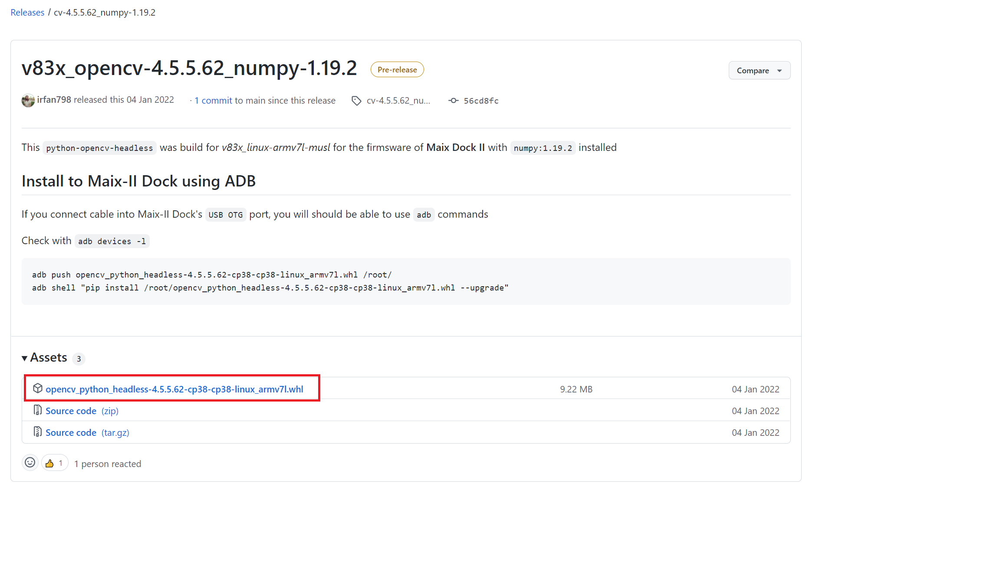
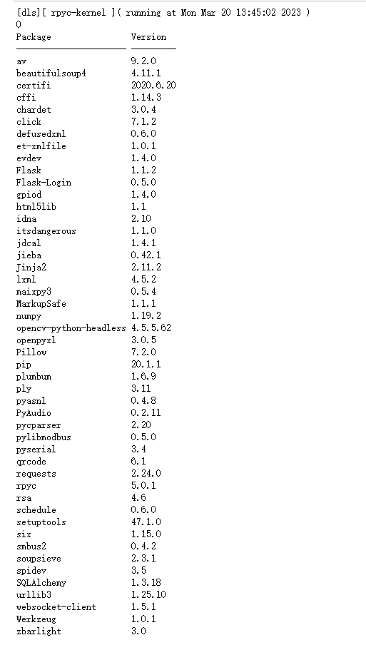

M2Dock 既然能够运行 Python, 那么我们也可以给它安装 Opencv。

<!-- more -->

## 前言

由于 V831 性能有限，且交叉编译什么的对于大多数人来说太烦琐了，因此这里提供一个 github 上的一位的大神 [irfan798](https://github.com/irfan798) 所 release 的一个适用于 M2Dock 的 Opencv 库。

仓库地址: [v83x_opencv-4.5.5.62_numpy-1.19.2](https://github.com/irfan798/maix3_opencv_python/releases/tag/cv-4.5.5.62_numpy-1.19.2)

相关的使用方法在 release 页面已经写了，但是不会操作话可以继续往下面看。

## 下载、安装、运行

- M2Dock 版本为最新镜像。

### 下载 opencv 安装文件



点击上图中红框处的文件即可下载由 [irfan798](https://github.com/irfan798) 所发布的适用于 M2Dock 的 Opencv Python 安装包。

把下载下来的名为 `opencv_python_headless-4.5.5.62-cp38-cp38-linux_armv7l.whl` 文件复制到由 M2Dock 在电脑上所显示的 U 盘中。

> 下载站备份站： [点我](https://dl.sipeed.com/shareURL/others/m2dock_opencv)

### 安装 opencv 软件包

在 adb 命令行终端中依次执行下面的命令来在 M2Dock 上安装刚刚所下载的 Opencv Python 安装包：

安装的时候显示内存不足的话，可以在 M2Dock 上执行 `rm -rf home/model/` 删除内置模型文件来腾出空间安装 Opencv.

下面的安装操作都在 M2Dock 的命令终端执行。

```shell
sync  #刷新所有文件
pip install /root/opencv_python_headless-4.5.5.62-cp38-cp38-linux_armv7l.whl --upgrade #安装刚刚下载的 Opencv Python 安装包
```

### 查看运行结果

成功安装完之后我们可以在 M2Dock 上运行 Opencv 了。如下所示:

```python
import os
# 当前系统为  v831-m2dock-maixpy3-0.5.4-20230310.zip 系统镜像
# https://api.dl.sipeed.com/shareURL/MaixII/MaixII-Dock/SDK/release 
print(os.system("pip list > /tmp/tmp.log"))
with open("/tmp/tmp.log") as f:
    print(f.read())
```

结果如下：



从上面可以看到有 `opencv` 和 `numpy`。在自己的执行结果中没有看到 `Numpy` 的话, 可以重新烧录最新的 m2dock 镜像来得到。

## 体验 opencv

```python
from maix import camera, display, image

import cv2
print(cv2)

img = image.new(size=(120, 120), mode="RGB", color=(255, 255, 255))
img.draw_line(0, 0, 120, 120)
img.draw_rectangle(40, 80, 120, 120, color=(255, 0, 0), thickness=16) #
img.draw_circle(120, 120, 20, color=(0, 255, 0))
img.draw_string(40, 40, "dalaoshu", 2, color=(0, 0, 255))

import cv2
import numpy as np
cv_img = cv2.imdecode(np.frombuffer(img.tobytes('jpg'), np.uint8), cv2.IMREAD_COLOR)

cv_img = cv_img[ : , : , (2,1,0)]

tmp = image.load(cv_img.tobytes(), cv_img.shape)

while True:
    img = camera.capture()    #从摄像头中获取一张图像
    img.draw_image(tmp)
    display.show(img)         #将图像显示出来
```

可以看到结果如下：


## 常见问题

如果 `pip list` 没看到 `Numpy`, 可以通过更新到最新的 m2dock 镜像来解决。

安装的时候显示内存不足的话，可以删除一下内置模型文件 `rm -rf home/model/`

建议使用 Maixpy3 来进行编程使用，这个 opencv 不支持使用 `show` 图像，且不能操作板子上的摄像头，只支持 usb 摄像头。
