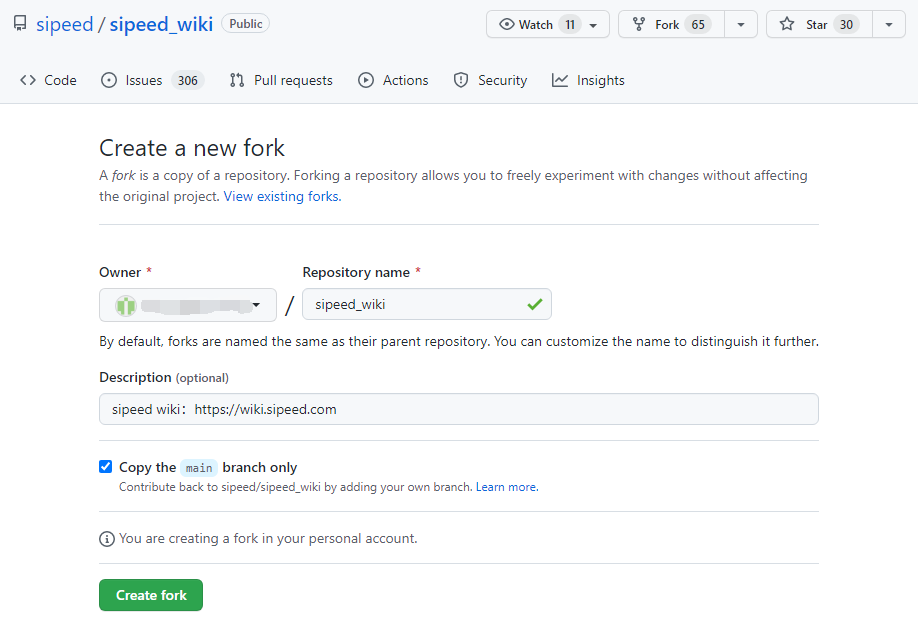
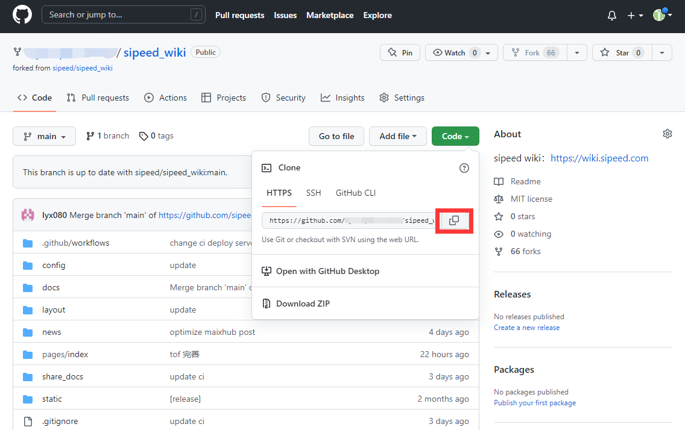
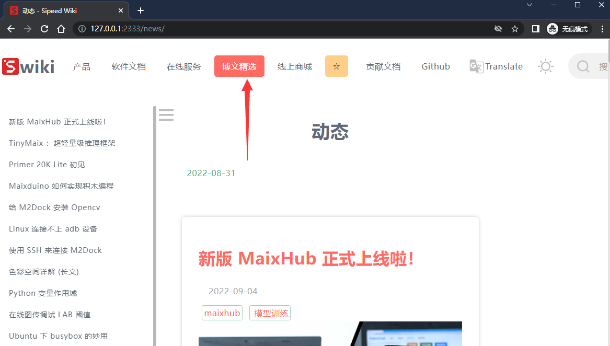
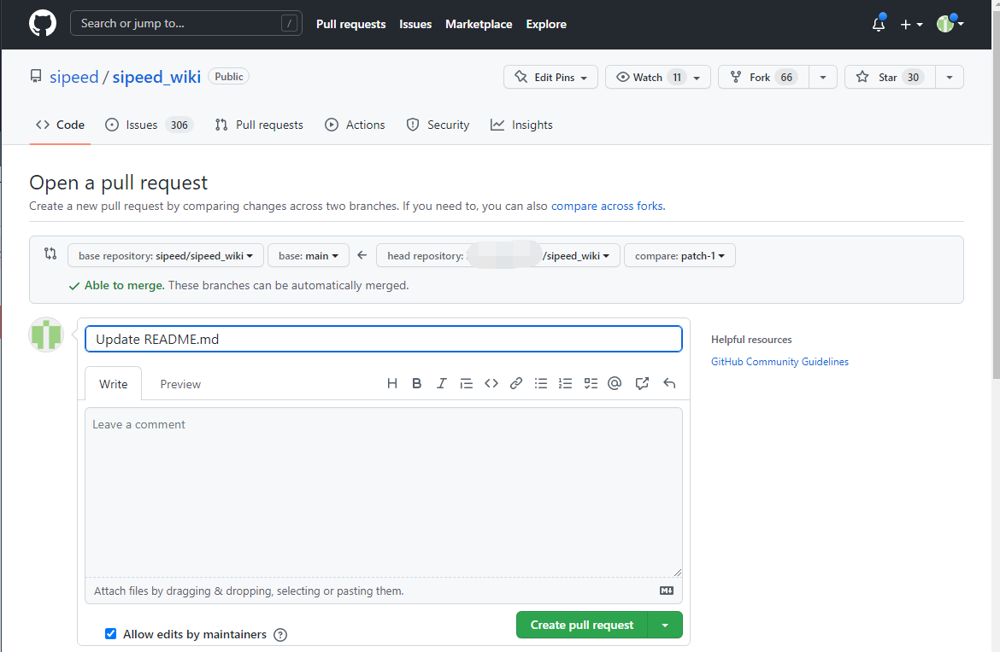

# 分享文档

如果你有什么好的文档想分享出来的话，可以通过 github 来分享到我们的 wiki 上面。

这里说明一些方法:

## 添加纯文本内容

目前 wiki 主要网页支持 markdown 和 ipynb 两种文档。

当然需要先登录进 github，然后在 https://github.com/sipeed/sipeed_wiki 页面选择 'Upload files'


这个时候会发现因为没有权限而被禁止上传。


点一下右上角的 Fork 来克隆一份到我们自己的仓库。



这样我们就可以在自己所 Fork 的仓库里面添加文件 'Upload Files' 了。


在接下来的页面中我们**把想要分享的文档直接拖拽到红框处，比如下图紫框中就是已经上传的文件，然后在蓝框中补充说明一下**。最后可以点击绿色的 `Commit changes` 来在自己所 Fork 的仓库提交了


提交完之后我们需要把自己的更改合并到 sipeed wiki 的 github 仓库


仓库管理员看到后会根据蓝框中的说明把文档移植到正确的位置。

> 感谢参与建设开源文档

## 添加包含图片的内容

因为添加图片的文档在 wiki 上面显示效果可能与在编辑器里所看到的效果不一样，因此建议在本地构建一下 wiki 来查看自己所编写的文档在 wiki 上面显示的实际结果，所以不建议像上面一样直接 `Upload Files`。

需要先 Fork Sipeed 的仓库，这样自己就可以编辑 wiki 仓库了（当然所编辑的仓库应该是你所 Fork 的），然后自己将所 Fork 的仓库 Clone 到本地，这样在后面完成添加文档后就能够直接将所 clone 的仓库推送到远程仓库了，不然可能会因为权限相关的问题导致不少麻烦~

对于下面的命令，我们需要将第一行的 `https://github.com/sipeed/sipeed_wiki.git` 替换成我们所 Fork 为自己的仓库的地址

```bash
git clone https://github.com/sipeed/sipeed_wiki.git
pip install teedoc
cd sipeed_wiki
teedoc install
teedoc serve
```

在我们所 Fork 的 Sipeed wiki 的仓库中，点击下图所标注的位置来获得当前仓库的地址。



这里以所获得的仓库地址 https://github.com/example/sipeed_wiki.git 为例，将上面的命令行改成下面的形式就可以直接 clone、在本机构建 wiki 网站了，然后访问 [127.0.0.1:2333](127.0.0.1:2333) 查看构建效果。

```bash
git clone https://github.com/example/sipeed_wiki.git
pip install teedoc
cd sipeed_wiki
teedoc install
teedoc serve
```

wiki 仓库里面的主要文档存在的文件目录如下：

```bash
.
├── docs                ## 文档路径
│   ├── hardware        ## 产品文档
│   └── soft            ## 软件文档
└── news                ## 博文精选
```

文档文件以 markdown 和 ipynb 为主，需要会相关语法~

一般来说添加内容到 news/ 就可以；自己新建文件夹然后添加内容。

然后可以在本地电脑所构建的 wiki 的博文精选里面看到自己所添加文档在 wiki 上面的实际显示效果了。



自己对添加内容满意的话，将本地的仓库推送到远程的 github 仓库，接着给 Sipeed wiki 仓库提交代码。


点击上面的 `Open pull request` 后会打开下图的界面，我们选择 `Create pull request` 即可后就提交上去了。



仓库管理员看到之后，会在确认合理、可用后接受提交申请。

> 感谢参与建设开源文档